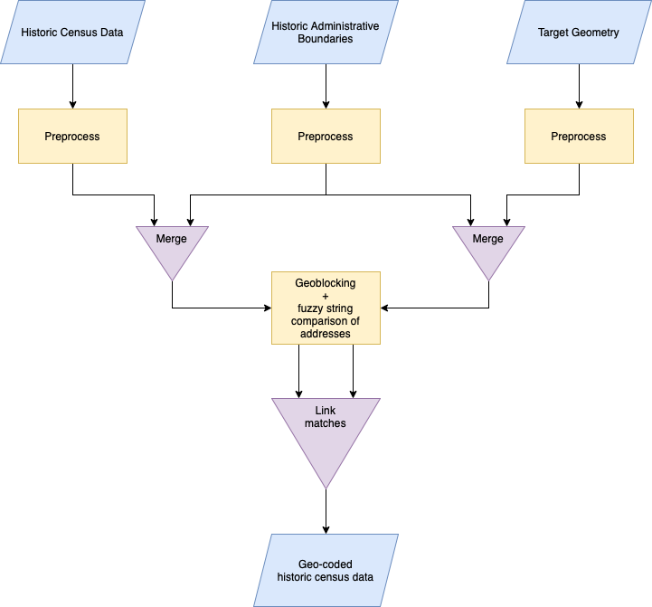
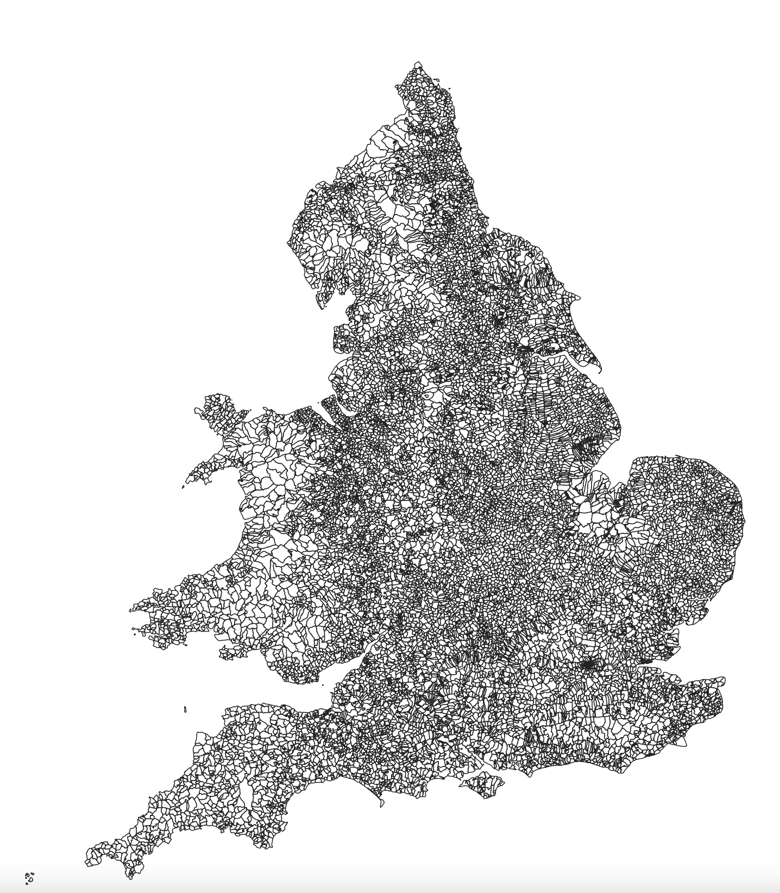
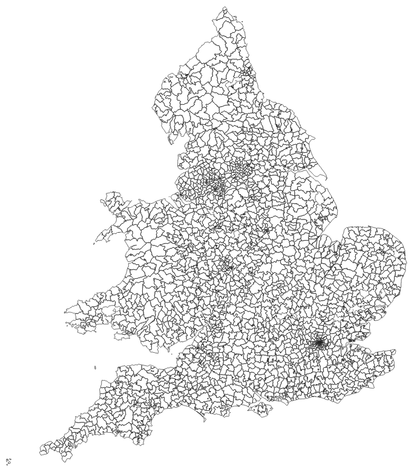
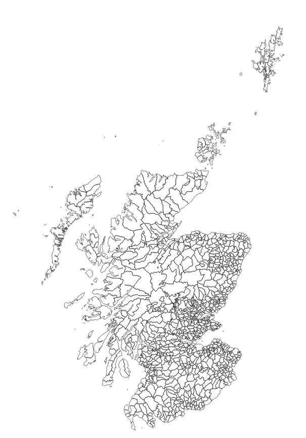
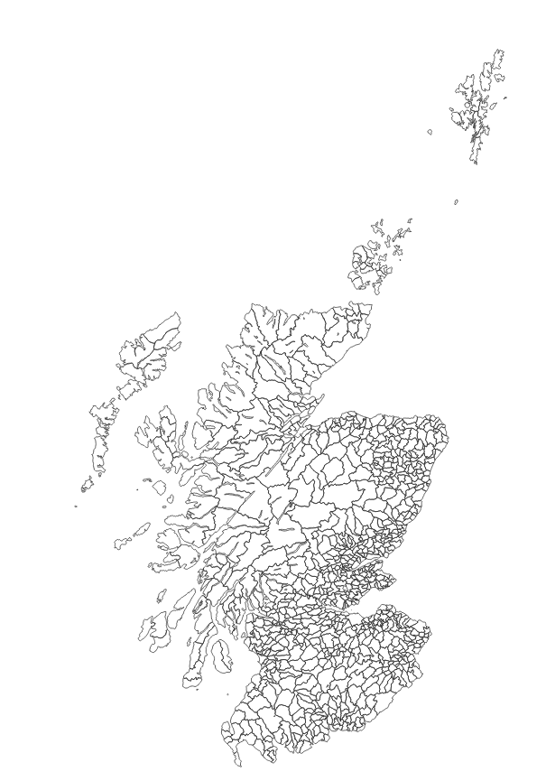

# historic-census-gb-geocoder


## What is historic-census-gb-geocoder?

**historic-census-gb-geocoder** links streets in historic census data for Great Britain 1851-1911 to their 'real-world' geographic location using geo-blocking and fuzzy string matching. You can pick any or all census years in [Integrated Census Microdata (I-CeM)](#integrated-census-microdata-i-cem) and link them to a target geometry dataset (or datasets) of your choosing.

It uses boundary datasets of historic administrative units (e.g. Parishes, Registration Sub-Districts) for each census year (1851-1911) and country (England and Wales, or Scotland) to assign census addresses and target geometry addresses to the appropriate historic administrative unit. This restricts fuzzy string matching between census and target geometry addresses to the correct historic boundary and disambiguates common street names found across the coutnry (e.g. High Street), resulting in higher quality matches.

The figure below gives an overview of the process:



# Contents
- [What is historic-census-gb-geocoder?](#What-is-historic-census-gb-geocoder?)
- [Installation and setup](#installation)
  - [Set up a conda environment](#set-up-a-conda-environment)
  - [Method 1: pip](#method-1)
  - [Method 2: source code (for developers)](#method-2)
<!-- - [Overview](#overview) -->
- [Data Input](#data-input)
  - [Integrated Census Microdata (I-CeM)](#integrated-census-microdata-i-cem)

    **England and Wales**
  - [Parish Boundary Data (EW ONLY)](#Parish-Boundary-Data-(EW-ONLY))
  - [1851EngWalesParishandPlace I-CeM Lookup Table (EW ONLY)](#1851engwalesparishandplace-i-cem-lookup-table-(EW-ONLY))
  - [Registration Sub-District (RSD) Boundary Data (EW ONLY)](#registration-sub-district-rsd-boundary-data-(ew-only))
  - [Registration Sub-District (RSD) Lookup Table (EW ONLY)](#registration-sub-district-rsd-lookup-table-ew-only)

    **Scotland**
  - [National Records of Scotland - Historic Civil Parishes pre-1891 and Civil Parishes (post 1891) Boundary Data and Lookup Table](#national-records-of-scotland---historic-civil-parishes-pre-1891-and-civil-parishes-post-1891-boundary-data-and-lookup-table)

  - [Target Geometry Data](#target-geometry-data)
    - [GB1900 Gazetteer](#gb1900-gazetteer)
    - [OS Open Roads](#os-open-roads)
- [Credit, re-use terms, and how to cite](#credit-re-use-terms-and-how-to-cite)
- [Acknowledgements](#acknowledgements)


## Installation

### Set up a conda environment

I recommend installation via Anaconda (refer to [Anaconda website and follow the instructions](https://docs.anaconda.com/anaconda/install/)).

* Create a new environment for `historic-census-gb-geocoder` called `geocoder_py38`:

```bash
conda create -n geocoder_py38 python=3.8
```

* Activate the environment:

```bash
conda activate geocoder_py38
```
### Method 1

***Not added to pypi yet - use method 2***
* Install `historic-census-gb-geocoder`:

 ```bash
pip install historic-census-gb-geocoder
```

### Method 2

* Clone `historic-census-gb-geocoder` source code:

```bash
git clone https://github.com/Living-with-machines/historic-census-gb-geocoder.git
```

* Install:

```bash
cd /path/to/historic-census-gb-geocoder
pip install -v -e .
```

Edit `/path/to/` as appropriate to the directory that you cloned `historic-census-gb-geocoder` into. E.g. `/Users/jrhodes/historic-census-gb-geocoder`

### To run

```bash
python3 historic_census_gb_geocoder.py
```

### Set parameters
### Folder structure and data

<!-- The [input_config.yaml](inputs/input_config.yaml) file allows you to adjust many variables for each census year, the other input files, and the target geometry datasets. These are detailed in the respective section under [Data Inputs](#data-inputs). -->

The filepaths for all the input data can be set by the user in [input_config.yaml](inputs/input_config.yaml) - for further information see the respective section under [Data Input](#data-input). We recommend the following directory structure for `data/input`, `inputs`, and `sample`.

The parent output directory is also set by the user in [input_config.yaml](inputs/input_config.yaml):

```yaml
general:
  output_data_path: "data/output/"
```

The directory structure of `data/output/` is created automatically when `historic-census-gb-geocoder` runs, and creates directories for each census year, country, and target geometry dataset.

```bash
├── data
│   ├── input
│   │   ├── census
│   │   │   ├── EW1851.txt
│   │   │   ├── EW1861.txt
│   │   │   ├── EW1881.txt
│   │   │   ├── EW1891.txt
│   │   │   ├── EW1901.txt
│   │   │   ├── EW1911.txt
│   │   │   ├── SCOT1851.txt
│   │   │   ├── SCOT1861.txt
│   │   │   ├── SCOT1871.txt
│   │   │   ├── SCOT1881.txt
│   │   │   ├── SCOT1891.txt
│   │   │   └── SCOT1901.txt
│   │   ├── ew
│   │   │   ├── 1851EngWalesParishandPlace
│   │   │   │   ├── 1851EngWalesParishandPlace.dbf
│   │   │   │   ├── 1851EngWalesParishandPlace.prj
│   │   │   │   ├── 1851EngWalesParishandPlace.sbn
│   │   │   │   ├── 1851EngWalesParishandPlace.sbx
│   │   │   │   ├── 1851EngWalesParishandPlace.shp
│   │   │   │   └── 1851EngWalesParishandPlace.shx
│   │   │   ├── parish_dicts_encoding
│   │   │   │   ├── 1851_ICeM_DICTIONARY_CODED.txt
│   │   │   │   ├── 1861_ICeM_DICTIONARY_CODED.txt
│   │   │   │   ├── 1871_DICTIONARY_CODED.txt
│   │   │   │   ├── 1881_ICeM_DICTIONARY_CODED.txt
│   │   │   │   ├── 1891_ICeM_DICTIONARY_CODED.txt
│   │   │   │   ├── 1901_ICeM_DICTIONARY_CODED.txt
│   │   │   │   ├── 1911_ICeM_DICTIONARY_CODED.txt
│   │   │   │   ├── PAR1851_RSD_MATCH.txt
│   │   │   │   └── finalEWnondiss1851_1911.txt
│   │   │   ├── icem_parish_lkup
│   │   │   │   └── UKDS_GIS_to_icem.xlsx
│   │   │   └── rsd_boundary_data
│   │   │       ├── RSD_1851_1911_JR.cpg
│   │   │       ├── RSD_1851_1911_JR.dbf
│   │   │       ├── RSD_1851_1911_JR.prj
│   │   │       ├── RSD_1851_1911_JR.sbn
│   │   │       ├── RSD_1851_1911_JR.sbx
│   │   │       ├── RSD_1851_1911_JR.shp
│   │   │       ├── RSD_1851_1911_JR.shp.xml
│   │   │       └── RSD_1851_1911_JR.shx
│   │   ├── scot
│   │   │   └── scot_parish_boundary
│   │   │       ├── CivilParish1930
│   │   │       │   ├── CivilParish1930.dbf
│   │   │       │   ├── CivilParish1930.prj
│   │   │       │   ├── CivilParish1930.shp
│   │   │       │   ├── CivilParish1930.shp.xml
│   │   │       │   ├── CivilParish1930.shx
│   │   │       │   └── CivilParish1930Lookup.xls
│   │   │       ├── CivilParish_pre1891
│   │   │       │   ├── CivilParish_pre1891.CPG
│   │   │       │   ├── CivilParish_pre1891.dbf
│   │   │       │   ├── CivilParish_pre1891.prj
│   │   │       │   ├── CivilParish_pre1891.sbn
│   │   │       │   ├── CivilParish_pre1891.sbx
│   │   │       │   ├── CivilParish_pre1891.shp
│   │   │       │   ├── CivilParish_pre1891.shp.xml
│   │   │       │   ├── CivilParish_pre1891.shx
│   │   │       │   └── scotland-parishes-1755-1891.xlsx
│   │   │       └── scotboundarylinking.xlsx
│   │   ├── target_geoms
│   │   │   ├── oproad_essh_gb-2
│   │   │   │   ├── data
│   │   │   │   │   ├── HP_RoadLink.cpg
│   │   │   │   │   ├── HP_RoadLink.dbf
│   │   │   │   │   ├── HP_RoadLink.prj
│   │   │   │   │   ├── HP_RoadLink.shp
│   │   │   │   │   ├── HP_RoadLink.shx
│   │   │   │   │   ├── HP_RoadNode.cpg
│   │   │   │   │   ├── HP_RoadNode.dbf
│   │   │   │   │   ├── HP_RoadNode.prj
│   │   │   │   │   ├── HP_RoadNode.shp
│   │   │   │   │   ├── HP_RoadNode.shx
│   │   │   │   │   └── ...
│   │   │   │   ├── doc
│   │   │   │   │   └── licence.txt
│   │   │   │   └── readme.txt
│   │   │   ├── gb1900
│   │   │   │   └── gb1900_gazetteer_complete_july_2018.csv
│   │   │   └── target_geom3
│   │   │       └── ...
│   │   └── sample
│   │       ├── census
│   │       └── target_geoms
│   │           ├── target_geom1
│   │           └── target_geom2
├── inputs
└── output
        └── 1851
            └── EW
                ├── target_geom1
                │   ├── linked
                │   ├── linked_duplicates
                │   └── lookup
                └── target_geom2
                    ├── linked
                    ├── linked_duplicates
                    └── lookup
```

<!-- 

## In depth discussion of processing steps etc?

How it works etc....

A census address is considered linked to a target address when:

  1. The fuzzy string comparison score is greater than the user-specified threshold
  2. It has the highest score after applying tf-idf weighting to the comparison score. Only census-address/target-address matches containing the following fields: 
    1. Assign streets in a target geometry dataset to the appropriate historic administrative unit. When a target geometry dataset comprises linestrings, it creates new geometries so that long roads spanning more than one historic administrative unit are split at the boundary of each unit so people are linked to the correct portion of the street based on which unit they live in.
  
  -->

## Data Input
This is a list and discription of the datasets you need to download and save locally in order to run the scripts correctly. Each section below describes the dataset, citation and copyright details, and how to set parameters in the relevant section of [input_config.yaml](inputs/input_config.yaml).


### Integrated Census Microdata (I-CeM)

#### Description

I-CeM census datasets, which are digitised individual-level 19th and early 20th century census data for Great Britain, covering England and Wales 1851-1911 (except 1871), and Scotland 1851-1901. They are 12 `.txt` files in total, each containing tab delimited census data.

These files have been created by merging two versions of the I-CeM datasets together, which contain different types of information and have different access restrictions. You need both to perform geocoding on the full I-CeM dataset. There is an anonymised version ([SN 7481](https://beta.ukdataservice.ac.uk/datacatalogue/studies/study?id=7481)) and a 'Names and Addresses - Special Licence' version ([SN 7856](https://beta.ukdataservice.ac.uk/datacatalogue/studies/study?id=7856)). The anonymised version ([SN 7481](https://beta.ukdataservice.ac.uk/datacatalogue/studies/study?id=7481)) is downloadable via the UKDS after signing up to their standard end user licence. The anonymised version does not contain individuals' names and addresses but contains a unique id `RecID` for each person that links them to their name and address held in the 'Special Licence' version ([SN 7856](https://beta.ukdataservice.ac.uk/datacatalogue/studies/study?id=7856)). As its name suggests, access to the name and address data in I-CeM is by application for a special licence, which requires review by UKDS and the owners ([Findmypast/Brightsolid](https://www.findmypast.co.uk)) of the transcriptions on which I-CeM is based.

Further documentation on I-CeM, including how it was created and the variables it contains can be found [here](https://www.essex.ac.uk/research-projects/integrated-census-microdata).

The `historic-census-gb-geocoder` uses the following fields from these census files:

*England and Wales only

FIELD|DESCRIPTION
--|--
RecID|Unique id for each person
Address|Street Address
ConParID*|Consistent Parish ID
ParID|Parish IDs
RegCnty|Registration County

*Sample Data (fabricated)*
RecID|Address|ConParID*|ParID|RegCnty
--|--|--|--|--
1|23 High Street|12|21|Essex
2|23 High Street|12|21|Essex
3|23 High Street|12|21|Essex
4|23 High Street|12|21|Essex
5|25 High Street|12|21|Essex
6|25 High Street|12|21|Essex

#### Citation

>Schurer, K., Higgs, E. (2020). Integrated Census Microdata (I-CeM), 1851-1911. [data collection]. UK Data Service. SN: 7481, DOI: 10.5255/UKDA-SN-7481-2
Schurer, K., Higgs, E. (2022). Integrated Census Microdata (I-CeM) Names and Addresses, 1851-1911: Special Licence Access. [data collection]. 2nd Edition. UK Data Service. SN: 7856, DOI: 10.5255/UKDA-SN-7856-2

#### Parameters in [input_config.yaml](inputs/input_config.yaml)

Under the `census_config` are the settings for each census year (in this case England and Wales 1851):

Set `runtype` to `True` if you want to geocode this census year, or set to `False` if you want to skip this year.

Set `census_file` to the path of the census data file, you need to set this for each census year.

```yaml
census_config:
  EW_1851:
    country: "EW"
    year: 1851
    runtype: True # set to 'True' to run geo-coding on this census; set 'False'

# Parameters for input census file

    census_file: "data/input/census/EW1851_anonymised.txt"
    census_fields:
      uid: "safehaven_id" # unique person id; for non-Turing implementation will be changed to 'RecID'
      address: "address_anonymised" # currently address field stripped of house numbers for compliance with DSH; in future will be 'Address'
      conparid: "ConParID" # see I-CeM documentation and readme
      parid: "ParID" # see I-CeM documentation and readme
      county: "RegCnty" # see I-CeM documentation and readme

    csv_params: # parameters passed to dask/pandas read_csv
      sep: "\t" # passed to 'sep' parameter of dask read_csv
      encoding: "latin-1" # passed to 'encoding' parameter of pandas read_csv
      blocksize: "25e6" # passed to 'blocksize' parameter of dask read_csv
      quoting: 3 # must be int 0,1,2, or 3. Passed to 'quoting' parameter of pandas read_csv
      na_values: "." # Passed to 'na_values' parameter of pandas read_csv

# File containing regex patterns to apply to the address field

    census_standardisation_file: "inputs/icem_street_standardisation.json" # regex replacement file

# Parameters for output files
    census_output_params:
      partition_on: "RegCnty" # must be one of the cols specified in 'census_fields'
      new_uid: "unique_add_id" # name of new unique id field (see documentation)
      sep: "\t"
      index: False
      filetype: ".tsv"
```

Optionally, set `census_standardisation_file` to the path to a json standardisation file containing regex replacements to apply to the address field of the census data.

For example:

```json
{
	"\\sST\\.$|\\sST$":" STREET",
	"\\sRD\\.$|\\sRD$":" ROAD",
	"\\sPL\\.$|\\sPL$":" PLACE",
	"[^A-Z\\s]":"",
	"^\\s*$":null
}
```

### Parish Boundary Data (EW ONLY)

#### Description

A shapefile (`.shp`) and associated files of 1851 Parish Boundary data for England and Wales. The boundary dataset looks like this:



This boundary dataset can be linked to I-CeM using [1851EngWalesParishandPlace I-CeM Lookup Table](#1851engwalesparishandplace-i-cem-lookup-table-england-and-wales-only) to create consistent parish geographies for England and Wales across the period 1851-1911. The consistent parish geographies are used by `historic-census-gb-geocoder` in conjunction with boundary datasets for Registration Sub Districts (RSD) to assign streets in target geometry datasets to a historic parish/RSD administrative unit (see [Overview](#overview) for more details.)

FIELD|DESCRIPTION
--|--
ID|Unique ID for parish, links to [1851EngWalesParishandPlace I-CeM Lookup Table](#1851engwalesparishandplace-i-cem-lookup-table-england-and-wales-only)
geometry|Polygon or Multipolygon boundary data

*Sample Data*

ID|geometry
--|--
0|MultiPolygon (((324609.9061836339533329 553449.56249322975054383, 324656.15613449434749782…)))
1|MultiPolygon (((446743.09374157758429646 400075.09375633631134406, 446731.84381735557690263…)))
2|MultiPolygon (((579932.99360200657974929 144415.23930413232301362, 579938.06249888404272497…)))
3|MultiPolygon (((408229.88241174072027206 604962.03670125640928745…)))

The files and documentation explaining the creation of the boundaries and the fields in the dataset are available from the UKDS [here](https://reshare.ukdataservice.ac.uk/852816/). Access to the files requires registration with the UKDS.

#### Citation:

>Satchell, A.E.M and Kitson, P.K and Newton, G.H and Shaw-Taylor, L. and Wrigley, E.A (2018). 1851 England and Wales census parishes, townships and places. [Data Collection]. Colchester, Essex: UK Data Archive. 10.5255/UKDA-SN-852232

#### Parameters in [input_config.yaml](inputs/input_config.yaml)

You need to set the path to the 1851 Parish Boundary Data for England and Wales Data in the `filepath` setting. If accessing this data via UKDS, the `projection` and `id_field` should remain the same as below.

```yaml
ew_config:
  parish_gis_config:
    filepath: "data/input/ew/1851EngWalesParishandPlace/1851EngWalesParishandPlace.shp" # path to parish boundary data
    projection: "EPSG:27700" # projection authority string passed to geopandas
    id_field: "ID" # unique id field that links to parish icem lookup table 'ukds_id_field'
```

### 1851EngWalesParishandPlace I-CeM Lookup Table (EW ONLY)

#### Description
A lookup table that links I-CeM to parish boundary data. A full description of the dataset and its intended uses can be found [here - Consistent Parish Geographies](https://www.essex.ac.uk/research-projects/integrated-census-microdata)

`historic-census-gb-geocoder` only uses three fields from the lookup table, which are:

FIELD|DESCRIPTION
--|--
UKDS_ID|ID that links to `ID` [1851 Parish Boundary Data for England and Wales](#parish-boundary-data-(EW-ONLY))
conparid_51-91|Consistent parish ID for census years 1851 to 1891; links to `ConParID` in [Integrated Census Microdata (I-CeM)](#integrated-census-microdata-i-cem)
conparid_01-11|Consistent parish ID for census years 1901 and 1911; links to `ConParID` in [Integrated Census Microdata (I-CeM)](#integrated-census-microdata-i-cem)

UKDS_ID|conparid_51-91|conparid_01-11
--|--|--
977|1|100001
909|1|100001
925|2|100001

#### Citation

The I-CeM website doesn't provide a citation for this lookup dictionary. The link to the data is under the heading 'Consistent Parish Geographies' [here](https://www.essex.ac.uk/research-projects/integrated-census-microdata)

#### Parameters in [input_config.yaml](inputs/input_config.yaml)

You need to set the path to the lookup file under `filepath`. The other settings should work with a version of the lookup table downloaded from the I-CeM website.

```yaml
parish_icem_lkup_config:
  filepath: "data/input/ew/UKDS_GIS_to_icem.xlsx" # path to parish to icem lookup table
  sheet: "link" # spreadsheet sheet containing data
  ukds_id_field: "UKDS_ID" # unique id field that links to parish boundary data 'id_field'
  na_values: "." # denotes na values in table
  conparid51_91_field: "conparid_51-91" # consistent parish id field for 1851 to 1891
  conparid01_11_field: "conparid_01-11" # consistent parish id field for 1901 and 1911
```

### Registration Sub-District (RSD) Boundary Data (EW ONLY)

#### Description
A shapefile and associated files of boundary data for Registration Sub-Districts in England and Wales 1851-1911. The correct RSD boundaries for each year are created by 'dissolving' the geometries on the appropriate `CEN` field, e.g. `CEN_1851` to create 1851 boundaries or `CEN_1901` to create 1901 boundaries. The boundary dataset looks like this:



FIELD|DESCRIPTION
--|--
CEN_1851|RSD ID for 1851
CEN_1861|RSD ID for 1861
CEN_1871|RSD ID for 1871
CEN_1881|RSD ID for 1881
CEN_1891|RSD ID for 1891
CEN_1901|RSD ID for 1901
CEN_1911|RSD ID for 1911
geometry|Polygon or Multipolygon boundary data

*Sample Data*

CEN_1851|CEN_1861|CEN_1871|CEN_1881|CEN_1891|CEN_1901|CEN_1911|geometry
--|--|--|--|--|--|--|--
10001|10001|10001|10001|10101|10101|10001|MultiPolygon (((525713.3125 183236.54690000042319298, 525824.6875...)))
10002|10002|10002|10002|10102|10102|10003|MultiPolygon (((527519.875 181175.60940000042319298...)))
10002|10002|10002|10002|10102|10102|10002|MultiPolygon (((525407.86180000007152557 180858.28729999996721745...)))
10001|10001|10001|10001|10101|10101|10002|MultiPolygon (((525405 181928, 525420 181906, 525487...)))

#### Citation
>Day, J.D. Registration sub-district boundaries for England and Wales 1851-1911 (2016). This dataset was created by the 'Atlas of Victorian Fertility Decline' project (PI: A.M. Reid) with funding from the ESRC (ES/L015463/1).

The RSD Boundaries were supplied directly by Joe Day at the University of Bristol and Alice Reid at the University of Cambridge. They are in the process of being deposited with UKDS and the citation may change to reflect this in due course.

#### Parameters in `input_config.yaml`

Set the path to the RSD Boundary shapefile (with associated files in the same directory). The `projection` should be the same as below when this file is accessible via UKDS.

```yaml
rsd_gis_config:
  filepath: "data/input/ew/rsd_boundary_data/RSD_1851_1911_JR.shp" # path to rsd boundary data
  projection: "EPSG:27700" # projection authority string passed to geopandas
```
### Registration Sub-District (RSD) Lookup Table (EW ONLY)

#### Description
A series of data dictionaries for linking I-CeM to the RSD Boundary Data. You can ignore `finalEWnondiss1851_1911.txt`, `PAR1851_RSD_MATCH.txt` and `1871_DICTIONARY_CODED.txt`. There are 6 other files - one for each census year in I-CeM - that link the `ParID` field in I-CeM to a `CEN_****` (e.g. `CEN_1851`) field in the RSD Boundary data above. 

`historic-census-gb-geocoder` uses the following fields from the lookup tables (this example is taken from the 1851 file):

FIELD|DESCRIPTION
--|--
ParID|Parish ID in [I-CeM](#integrated-census-microdata-i-cem)
CEN_1851|RSD ID in [RSD Boundary Data](#registration-sub-district-rsd-boundary-data-ew-only)

*Sample Data*

ParID|CEN_1851
--|--
1|10001
2|10002

#### Citation
>Day, J.D. Registration sub-district boundaries for England and Wales 1851-1911 (2016). This dataset was created by the 'Atlas of Victorian Fertility Decline' project (PI: A.M. Reid) with funding from the ESRC (ES/L015463/1).

The RSD Lookup Dictionaries were supplied directly by Joe Day at the University of Bristol and Alice Reid at the University of Cambridge. They are in the process of being deposited with UKDS and the citation may change to reflect this in due course.

#### Parameters in [input_config.yaml](inputs/input_config.yaml)

Set the file path to the Registration Sub-District (RSD) Lookup Table under the `filepath` setting. This needs to be done for each census year. The other settings work for the files supplied at time of writing - they can be changed if necessary once these files are available via UKDS.

```yaml
rsd_dictionary_config:
  "1851":
    filepath: "data/input/ew/parish_dicts_encoding/1851_ICeM_DICTIONARY_CODED.txt" # path to rsd dictionary lookup table
    cen_parid_field: "ParID" # ParID field that links to I-CeM ParID
    rsd_id_field: "CEN_1851" # unique id of rsd unit
    encoding: "utf-8" # file encoding
    sep: "\t"
    quoting: 3
```

#### National Records of Scotland - Historic Civil Parishes pre-1891 and Civil Parishes (post 1891) Boundary Data and Lookup Table

`data/input/scot_parish_boundary/` - contains two Scottish parish boundary files and a lookup table that links the boundary files to I-CeM.

There are Scottish parish boundary datasets for pre- and post-1891 civil parishes. A detailed discussion of the dataset and changes to the boundaries of Scottish parishes, see [National Records of Scotland - Historic Civil Parishes pre-1891](https://www.nrscotland.gov.uk/statistics-and-data/geography/our-products/other-national-records-of-scotland-nrs-geographies-datasets/historic-civil-parishes-pre-1891) and [National Records of Scotland - Civil Parishes (post 1891)](https://www.nrscotland.gov.uk/statistics-and-data/geography/our-products/other-national-records-of-scotland-nrs-geographies-datasets/civil-parishes). For further information on the major boundary changes around 1891, see also [Genuki](https://www.genuki.org.uk/big/sct/shennan/boundaries).

`scot_parish_boundary/CivilParish_pre1891/` - contains the shapefile and associated files for pre-1891 Scottish parish boundaries.



`scot_parish_boundary/CivilParish1930` - contains the shapefile and associated files for post-1891 Scottish parish boundaries.



Unlike the parish boundary datasets for England and Wales, there was no openly available lookup table that directly linked parish boundary data to I-CeM. Without a similar lookup table for Scotland, we would not be able to perform geo-blocking strategies required in the geo-coding script (e.g. only trying to match streets from the same parish across OS Open Roads/GB1900 and I-CeM).

To link the Scottish parish boundary datasets to I-CeM, a lookup table has been created that associates each parish in the pre- and post-1891 boundary files with a corresponding parish in I-CeM. A separate lookup table for each census year has been produced - firstly, to use the most appropriate boundary dataset (pre or post 1891), and secondly, to link to parishes from each census year via the `ParID` variable (rather than rely on consistent parish geographies across census years - the `ConParID` variable).

The structure of the lookup table is as follows:

FIELD|VALUE
--|--
"name" / "JOIN_NAME_"|Parish name from boundary dataset; "name" for post-1891, "JOIN_NAME_" for pre-1891.
ParID_link|ParID of corresponding parish in I-CeM
Notes|Notes on how the link was made; "exact" = parish names matched exactly between the boundary dataset and I-CeM; see individual files for other match types.

Scotland, 1901 example:

name| ParID_link | notes
-- | -- | --
NEW CUMNOCK | 100595 | exact
OLD CUMNOCK | 100597 | exact
DAILLY | 100572 | exact
SMALL ISLES | 100119 | exact

### Target Geometry Data

`historic-census-gb-geocoder` can link I-CeM data to any existing target geometry dataset in shapefiles or in csv files by adjusting the following settings:

```yaml
target_geoms: # geometry data to link census data to
# General
  name_of_target_geometry: # name of geometry data
    path_to_geom: "path/to/data" # path to geometry data; can be directory if multiple files or path to file.
    projection: "EPSG:****" # projection authority string passed to geopandas, eg. "EPSG:27700"
    file_type: "" # file type; accepts 'shp' or 'csv'
    geom_type: "" # type of geometry, accepts either 'line' or 'point'; determines union operations (see documentation)

    filename_disamb: "" # optional (for multiple files); correct filename to read if multiple files in directory, e.g. OS Open Roads contains 'RoadNode' and 'RoadLink'. If 'RoadLink.shp' provided, it will ignore 'RoadNode.shp'.
    data_fields: # fields to read from file
      uid_field: "" # unique id field, e.g. 'nameTOID'
      address_field: "" # address field, e.g. 'name1'
      geometry_field: "" # if shapefile or csv with one geometry column (e.g. wkt string) give name of field here e.g. 'geometry'
      long_field: "" # optional; defaults to ""; for use with csv geometry in lat/long format across 2 columns; `geometry_format` must be set to 'coords' when using long and lat fields.
      lat_field: "" # same as long_field
    standardisation_file: "" # optional; file to perform regex replacement on address field
    query_criteria: "" # optional; query to pass to pandas 'df.query'

# shp file specific

# csv file specific
    encoding: "utf-16" # for 'csv' only; file encoding passed to pandas read_csv
    sep: "," # for 'csv' only; seperator value passed to pandas read_csv
    geometry_format: "" # only for 'csv'; if  for use with 'csv' 
```

Optionally, set `standardisation_file` to the path to a json standardisation file containing regex replacements to apply to the address field of the target geometry data.

For example:

```json
{
	"\\sST\\.$|\\sST$":" STREET",
	"\\sRD\\.$|\\sRD$":" ROAD",
	"\\sPL\\.$|\\sPL$":" PLACE"
}
```


#### GB1900 Gazetteer

##### Description

GB1900 file. Contains transcriptions of text labels from the Second Edition County Series six-inch-to-one-mile maps covering the whole of Great Britain, published by the Ordnance Survey between 1888 and 1914. As well as the labels, GB1900 Gazetteer contains the geographic coordinates of the labels (usually taken from the upper, left-hand corner of the label).

The version of the GB1900 Gazetteer used in this repo is the 'COMPLETE GB1900 GAZETTEER', which can be downloaded from [here](http://www.visionofbritain.org.uk/data/#tabgb1900).

##### Citation

It is available on a CC-BY-SA licence. Taken from the data documentation:

>Please reference this work as the "GB1900 Gazetteer" made available by the GB1900 Project. You must acknowledge "the Great Britain Historical GIS Project at the University of Portsmouth, the GB1900 partners and volunteers".

>You may call any work you derive from this dataset whatever you like EXCEPT that you must not name your work "the GB1900 gazetteer", or any other name including "GB1900" or "Great Britain 1900". When using or citing the work, you should not imply endorsement by the GB1900 project or by any of the project partners.

##### Parameters in `input_config.yaml`

Insert once these geometry field changes have been made.

#### OS Open Roads
##### Description

Shapefiles and documentation from the Ordnance Survey's Open access modern road vector data. Available here to download: https://www.ordnancesurvey.co.uk/business-government/products/open-map-roads.

`oproad_essh_gb-2` contains a `data` folder, which stores `RoadLink` and `RoadNode` files. historic-census-gb-geocoder only requires the `RoadLink` files.

##### Citation

Taken from the Ordance Survey website:

>Our open data products are covered by the Open Government Licence (OGL), which allows you to: copy, distribute and transmit the data;
adapt the data; and
exploit the data commercially, whether by sub-licensing it, combining it with other data, or including it in your own product or application.
We simply ask that you acknowledge the copyright and the source of the data by including the following attribution statement: Contains OS data © Crown copyright and database right 2022.

##### Parameters in `input_config.yaml`

Insert once these geometry field changes have been made.

## Credit, re-use terms, and how to cite
`historic-census-gb-geocoder` relies on several datasets that require you to have an account with the UK Data Service (UKDS) to sign their standard end user licence. Please see individual datasets listed under [Data Inputs](#data-inputs)

#### 8. Street Standardisation

*The naming conventions need to be improved here - this file is for use with the GB1900 Gazetteer.*

*There is plenty of scope for expanding the range of regex patterns used to clean the address strings.*

`street_standardisation.json` - contains regex patterns to find and replacement words. Currently used to expand abbreviations in GB1900 Gazetteer, e.g. Rd to Road.

#### 9. I-CeM Street Standardisation

*There is plenty of scope for expanding the range of regex patterns used to clean the address strings.*

`icem_street_standardisation.json` - contains regex patterns to find and replacement words. Currently used to expand abbreviations in I-CeM, e.g. Rd to Road. Also removes extra letters left at the start of the address strings after removing digits (to comply with safehaven rules). E.g. '68A High Street' leaves 'A High Street', which is then cleaned to 'High Street'.


### Data Output

```bash
└── output
        └── 1851
            └── EW
                ├── target_geometry1
                │   ├── lookup
                │   ├── linked_duplicates
                │   ├── linked
                │   ├── target_geometry1_1851.geojson
                │   └── target_geometry1_1851_summary.tsv
                └── target_geometry2
                    ├── lookup
                    ├── linked_duplicates
                    ├── linked
                    ├── target_geometry2_1851.geojson
                    └── target_geometry2_1851_summary.tsv
```
Output files for each target geometry dataset and census year/country are written to separate directories. For each partition of the census (e.g. a county), 3 types of delimited text files are output to the corresponding directories `linked`, `linked duplicates`, `lookup`.

Filenames are structured as follows:
`{census_country}_{census_year}_{target_geometry_name}_{partition_value}`

with `link`, `linkdup`, or `lkup` appended to the end as appropriate, e.g.

e.g. `EW_1851_gb1900_Durham_lkup`.

---

#### Linked

Census addresses considered a match to an address in the target geometry dataset.

fields|
-|
target geometry address|
census address unique id|
target geometry address unique id|
census address|
tfidf weighting|
fuzzy string comparison score|
weighted fuzzy string comparison score|

*Sample output*

final_text|unique_add_id|gb1900_1851|address_anonymised|tfidf_w|rapidfuzzy_wratio_s|rapidfuzzy_wratio_ws|
--|--|--|--|--|--|--|
SOUTH HILL PARK|BAGSHOT ROAD AND SOUTH HILL PARK_1452.0_1300001.0|5815d6182c66dc3849011ef2_1452.0_1300001|BAGSHOT ROAD AND SOUTH HILL PARK|0.0743637355789496|0.9|0.06692736202105463|
BARTHOLOMEW STREET|BARTHOLOMEW STREET  SHAWS COURT_1260.0_1200002.0|5848759c2c66dcdcda000168_1260.0_1200002|BARTHOLOMEW STREET  SHAWS COURT|0.06117412360590356|0.9|0.05505671124531321|
BARTHOLOMEW STREET|BARTHOLOMEW STREET  STILLMANS COTTAGES_1260.0_1200002.0|5848759c2c66dcdcda000168_1260.0_1200002|BARTHOLOMEW STREET  STILLMANS COTTAGES|0.05017107492325159|0.9|0.04515396743092643|

---

#### Linked duplicates

Census addresses with > 1 match to an address in the target geometry dataset.

The fields are the same as the `Linked` output:

fields|
-|
target geometry address|
census address unique id|
target geometry address unique id|
census address|
tfidf weighting|
fuzzy string comparison score|
weighted fuzzy string comparison score|

*Sample output*

name1|unique_add_id|os_open_roads_1851|address_anonymised|tfidf_w|rapidfuzzy_wratio_s|rapidfuzzy_wratio_ws|
--|--|--|--|--|--|--|
OLD BRACKNELL LANE EAST|BRACKNELL_1452.0_1300001.0|osgb4000000023476747_1452.0_1300001|BRACKNELL|0.1111111111111111|0.9|0.09999999999999999
BRACKNELL ROAD|BRACKNELL_1452.0_1300001.0|osgb4000000023487824_1452.0_1300001|BRACKNELL|0.1111111111111111|0.9|0.09999999999999999
OLD BRACKNELL LANE WEST|BRACKNELL_1452.0_1300001.0|osgb4000000023488088_1452.0_1300001|BRACKNELL|0.1111111111111111|0.9|0.09999999999999999

---

#### Lookup

Unique ids for individuals from the census for each census address and target geometry in [Linked](#linked).

*Sample output*

unique census id (e.g. RecID)|unique geometry id (e.g. gb1900_EW_1851)
--|--
20|52f1d84fd9dbf10005000574_12709.0_6230001
40|5360c84879ff6e000d001256_12753.0_6230006
41|52cd3f9cba830e0005003ba1_12737.0_6230004

---

#### New geometry file

For each target geometry dataset, an output file is written containing the geometry data with added historic administrative unit ids for that census country and year. Additionally, linestring geometries are split or combined depending on whether they run across multiple administrative boundaries.

*Sample output for OS Open Roads, England and Wales 1901*

field|description
--|--
new unique id (e.g. `os_open_roads_EW_1901`)|new unique id for street constructed from target geometry unique id field and historic administrative unit id(s); e.g. `osgb4000000006295134` (OS Open Roads ID) + `109960.0` (conparid_01-11 - Consistent Parish ID for 1901) + `5610001` (CEN_1901 - RSD Unique ID for 1901) = `osgb4000000006295134_109960.0_5610001`
target geometry unique id (e.g. `nameTOID`)|original unique id from target geometry dataset; e.g. `osgb4000000006295134`
target geometry address field (e.g. `name1`)|e.g. `FOREST DRIVE`
consistent parish id (e.g. `conparid_01-11`)|consistent parish ID for 1901, e.g. `109960.0`
registration sub-district id (e.g. `CEN_1901`)|registration sub-district id for 1901, e.g. `561001.0`
geometry|Linestring geometry data


```json
{
"type": "FeatureCollection",
"crs": { "type": "name", "properties": { "name": "urn:ogc:def:crs:EPSG::27700" } },
"features": [
{ "type": "Feature", "properties": { "os_open_roads_EW_1901": "osgb4000000006295134_109960.0_5610001", "nameTOID": "osgb4000000006295134", "name1": "FOREST DRIVE", "conparid_01-11": 109960.0, "CEN_1901": 5610001.0 }, "geometry": { "type": "LineString", "coordinates": [ [ 373661.0, 599187.0, 0.0 ], [ 373630.13, 599178.060000000055879, 0.0 ], [ 373599.270000000018626, 599169.12, 0.0 ] ] } },
{ "type": "Feature", "properties": { "os_open_roads_EW_1901": "osgb4000000006295135_109958.0_5610001", "nameTOID": "osgb4000000006295135", "name1": "COTTONSHOPE ROAD", "conparid_01-11": 109958.0, "CEN_1901": 5610001.0 }, "geometry": { "type": "LineString", "coordinates": [ [ 378191.35999999998603, 603573.690000000060536, 0.0 ], [ 378226.19, 603658.060000000055879, 0.0 ], [ 378317.0, 603878.0, 0.0 ], [ 378433.169999999983702, 604220.520000000018626, 0.0 ], [ 378646.0, 604848.0, 0.0 ], [ 378665.0, 604869.0, 0.0 ] ] } }]
}
```

By default, the files are output as `.geojson` files in the same projection as the historic boundary datasets and OS Open Roads and GB1900, which is `EPSG:27700`. Users can change these settings in [input_config.yaml](inputs/input_config.yaml). These parameters are passed to geopandas [GeoDataFrame.to_file](https://geopandas.org/en/stable/docs/reference/api/geopandas.GeoDataFrame.to_file.html). Currently, you can change the projection of the output geometries to either `EPSG:3857` or `EPSG:4326` (northings, easting will be converted to longlat).

```yaml
output_params:
  file_type: ".geojson"
  crs: "EPSG:27700"
  driver: "GeoJSON"
```
---

#### Summary

Delimited text file containing summary statistics on the proportions of people linked according to each census partition.

Fields|Description|
--|--|
partition|Census partition, e.g. a county|
inds_link|Number of individuals linked to a target geometry|
adds_link|Number (unique count) of addresses linked to target geometry|
adds_linkdup_count|Number (unique count) of addresses with > 1 match to target geometry|
inds_all|Number of all individuals in census partition|
adds_all|Number (unique count) of all addresses in census partition|
inds_link_perc|Percentage of all individuals linked to target geometry|
adds_link_perc|Percentage of all addresses linked to target geometry|
adds_linkdup_perc|Percentage of all addresses with > 1 match to target geometry|

*Sample output*

RegCnty|inds_linked|adds_linked|adds_duplink_count|inds_all|adds_all|inds_linked_perc|adds_linked_perc|adds_duplink_perc
--|--|--|--|--|--|--|--|--|
Anglesey|261|43|1|4257|2176|6.13107822410148|1.9761029411764706|0.04595588235294117
Bedfordshire|1875|192|3|12827|1668|14.617603492632728|11.510791366906476|0.1798561151079137
Berkshire|1984|244|12|19583|3184|10.13123627636215|7.663316582914573|0.37688442211055273
Brecknockshire|332|32|2|5978|2531|5.553696888591502|1.264322402212564|0.07902015013828526

## Acknowledgements

This work was supported by Living with Machines (AHRC grant AH/S01179X/1) and The Alan Turing Institute (EPSRC grant EP/N510129/1). Living with Machines, funded by the UK Research and Innovation (UKRI) Strategic Priority Fund, is a multidisciplinary collaboration delivered by the Arts and Humanities Research Council (AHRC), with The Alan Turing Institute, the British Library and the Universities of Cambridge, East Anglia, Exeter, and Queen Mary University of London.

Thanks to Joe Day and Alice Reid for supplying RSD Boundary data and lookups prior to their deposit with the UK Data Service.
