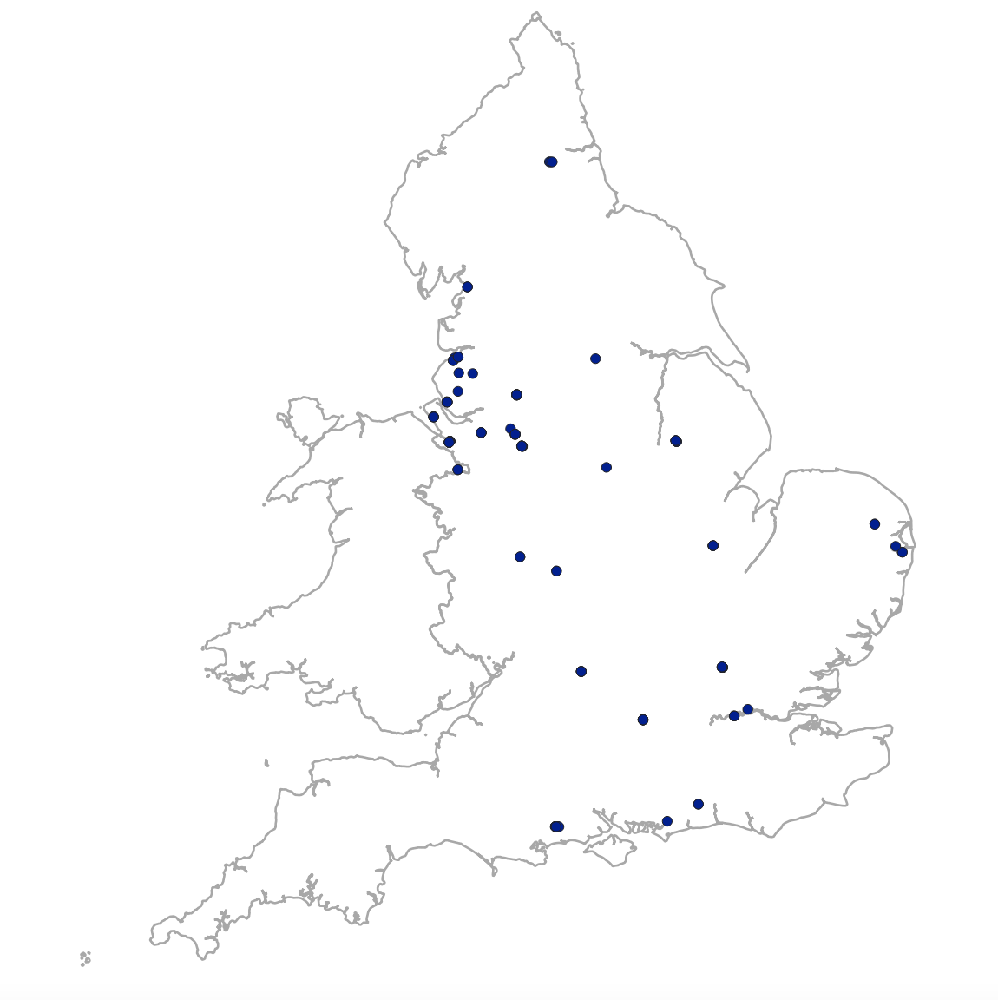

# CensusGeocoder


## What is CensusGecooder?

**CensusGeocoder** links addresses in [digitised historic census data for Great Britain 1851-1911](#integrated-census-microdata-i-cem) to their 'real-world' geographic location. For example, it takes the text 'Ruby Street' from the census and links it to a geometry dataset of your choice. We link to [OS Open Roads](#os-open-roads) and [GB1900](#gb1900-gazetteer) as our target geometry datasets as the best alternatives until a full vector dataset of nineteenth/early twentieth century streets is created (we'd love if this was available someday!)

**CensusGeocoder** allows you to use historic census data in new and powerful ways. Previously, the smallest spatial unit people in historic census data could be geo-located by was either a parish or registration sub-district (as well as larger units like registration districts and counties). But each of these administrative units - even parishes - necessitates aggregating individuals to quite large areas. Any sub-parish distinctions (like types of streets that people lived on, or perhaps how close someone lived to a factory or railway line) are lost. Typically, researchers used the centroids of parish polygons to conduct spatial analysis of the census. This meant that everyone in the parish was treated the same, e.g. *x* km from a station. **CensusGeocoder** locates individuals at property and street level, so we can now differentiate people street-by-street, and talk of people being *x* meters from a point of interest.

## How does it work?

It uses geo-blocking and fuzzy string matching. You can pick any or all census years in [Integrated Census Microdata (I-CeM)](#integrated-census-microdata-i-cem) and link them to a target geometry dataset (or datasets) of your choosing. It uses the relevant boundary datasets of historic administrative units (e.g. Parishes, Registration Sub-Districts) for each census year (1851-1911) and country (England and Wales, or Scotland) to assign census addresses and target geometry addresses to the appropriate historic administrative unit. This restricts fuzzy string matching between census and target geometry addresses to the correct historic boundary and disambiguates common street names found across the country (e.g. High Street), resulting in higher quality matches.

The figure below gives an overview of the process:


**Let's run through a specific example:**

<!-- Let's take 'Ruby Street' in South Manchester. In the 1901 census, there are 154 living on this particular Ruby Street. The Ruby Street we're interested in is located in `ParID` 

address|RegDist|Parish|ParID|ConParID
--|--|--|--|--|
RUBY STREET|Chorlton|SOUTH MANCHESTER|10873|108139
RUBY STREET|Chorlton|SOUTH MANCHESTER|10871|108139
-->

Let's take 'BOUNDARY LANE' in South Manchester in 1901 (it runs perpendicular to 'RUBY STREET' in the picture at the top). How do we link this 'BOUNDARY LANE' in the census to the same 'BOUNDARY LANE' in a GIS dataset of streets, like OS Open Roads. The challenge is that there will be lots of streets with the same name in the census and in those GIS files.

Here's the location of streets containing the words 'BOUNDARY LANE' in OS Open Roads. There are 50 streets with the name 'BOUNDARY LANE', and a further 3 named 'BOUNDARY LANE NORTH', 'BOUNDARY LANE SOUTH', and 'OLD BOUNDARY LANE'.

<!--  -->


OS Open Roads identify streets' exact locations but there's no inherent spatial relationship between them and the census. We need to classify the streets in the OS Open Roads according to historic boundaries that relate to the census data, in order to be able to differentiate all these streets with the same or similar names.

Let's look at some information about addresses that contain 'BOUNDARY LANE' in the census. The table below tells us which registration district, parish and registration sub-district each one is in. `NumInds` tells us how many people were living on each of these streets in 1901.

|RegCnty|RegDist|Parish|SubDist|ConParID|ParID|NumInds
|--|--|--|--|--|--|--|
Berkshire|Wallingford|SOUTH STOKE (OXON)|Wallingford|101064|1737|2
Buckinghamshire|Wycombe|HIGH WYCOMBE|Wycombe|101306|2115|89
Cheshire|Chester|CHESTER|Chester Castle|107952|10598|9
Cheshire|Chester|SALTNEY (FLINT)|Hawarden|107991|10650|72
Cheshire|Wirral|GAYTON|Neston|107999|10654|90
Lancashire|Chorlton|SOUTH MANCHESTER|Chorlton Upon Medlock|108139|10871|109
Lancashire|Chorlton|SOUTH MANCHESTER|Hulme|108139|10873|19
Lancashire|Ormskirk|BURSCOUGH|Scarisbrick|108085|10770|15
Lancashire|Ormskirk|SIMONSWOOD|Bickerstaffe|108071|10755|36
Lancashire|West Derby|EVERTON|South Everton|108037|10727|214
Lancashire|West Derby|KIRKBY|Fazakerley|108042|10721|6
Lancashire|West Derby|WEST DERBY|West Derby Western|108049|10729|297
London (Parts Of Middlesex, Surrey & Kent)|Camberwell|CAMBERWELL|St George|100003|235|188
London (Parts Of Middlesex, Surrey & Kent)|Southwark|NEWINGTON|St Peter Walworth|100003|211|161
Norfolk|Blofield|POSTWICK|Blofield|103249|4501|26
Norfolk|Blofield|THORPE NEXT NORWICH|Blofield|103248|4504|44
Nottinghamshire|Worksop|WORKSOP|Worksop|107257|9734|15

For each street in the census, we have quite a lot of geographical information that helps us distinguish streets with the same name. The `ConParID` and `ParID` fields link to existing GIS boundary datasets, which we can use to carve up our target geometry datasets.

`ConParID` refers to 'Consistent Parish ID'. There are two series of consistent parish boundaries - one that covers 1851 to 1891, and another set covering 1901 and 1911. Consistent parish boundaries don't reflect real parish boundaries, they're artificial units constructed by aggregating multiple parishes. See [here](https://www.essex.ac.uk/research-projects/integrated-census-microdata) for more information under the heading 'Consistent Parish Geographies'. We can map these consistent parish units: the `ConParID` field links to [Parish Boundary Data](#parish-boundary-data-england-and-wales-only) via a [lookup table](#1851engwalesparishandplace-i-cem-lookup-table-england-and-wales-only).

`ParID` is an internal parish identifier for I-CeM that links to [registration sub-district boundary data](#registration-sub-district-rsd-boundary-data-england-and-wales-only) via a [lookup table](#registration-sub-district-rsd-lookup-table-england-and-wales-only). This lookup table tells us which registration sub-district that each `ParID` is in for each census year. Registration sub-districts change from year-to-year, and they have different ids for each year. The name of the unique id field for 1901 is `CEN_1901`. The table below tells us that `ParID` 10871 is in `CEN_1901` 4640003. Once we know the unique id of each regstration sub-district, we don't need to use the `ParID` value anymore.

ParID - RSD Lookup Table:
ParID|CEN_1901|YEAR|COUNTRY|DIVISION|REGCNTY|REGDIST|SUBDIST|PARISH|
--|--|--|--|--|--|--|--|--|
10871|4640003|1901|ENG|VIII|LANCASHIRE|CHORLTON|CHORLTON UPON MEDLOCK|SOUTH MANCHESTER|
10873|4640004|1901|ENG|VIII|LANCASHIRE|CHORLTON|HULME|SOUTH MANCHESTER|

Below is a map of Manchester overlaid with these two different boundary datasets. The large area in green is the area covered by the consistent parish unit (this particular one is `ConParID` 108139). The black lines are the boundaries of the Registration Sub-Districts (RSDs) in that area. Each area bounded by a black line has its own `CEN_1901` id value.


Sometimes RSDs are larger than a consistent parish unit, but often they're smaller around urban centres like Manchester or London. In this example, they break up that large green area into smaller RSD/consistent parish combinations. This helps us disambiguate streets of the same name better than if we relied solely on the consistent parish unit - it's so large in this case that there are bound to be multiple streets with the same name and no way for us to know which one is which (in a systematic geographic sense for geo-blocking purposes). Creating new boundaries by combining RSDs and consistent parish units creates the smallest boundary units that we have for the historic census data.

Let's briefly turn back to OS Open Roads. We'll use these historic boundaries to classify roads in OS Open Roads. This will help us limit the number of streets to compare (we'll only be searching census streets and OS Open Roads streets that are in a similar area). 

Let's zoom in on the 'BOUNDARY LANE' to the south of Manchester:


We're within `ConParID` 108139 now. The image shows us the modern 'BOUNDARY LANE' from OS Open Roads overlaying a historic OS map. The path of the modern road closely follows but is not exactly the same as the historic road. This is one of the many challenges of using modern road vector data in lieu of historic road vector data!

We can see the road in relation to nearby RSD boundaries. Perhaps unsurprising given its name, 'BOUNDARY LANE' runs close to the boundaries of two RSDs. The ends of the road (marked in red) are in `CEN_1901` 4640003, but the middle of the road (marked in blue) is in neighbouring `CEN_1901` 4640004.

When assigning roads to consistent parish/RSD units, roads are split at the point they cross boundaries so that we match people to the correct segment of the road they live on. This only applies to linestring geometries of roads - not points (like GB1900 data) because points lie within a boundary and don't cross boundaries. (This is a shortcoming of using GB1900 point data despite the fact the street names it contains are contemporaneous with the 1891-1911 censuses).

Now we've overlaid the historic census boundaries on the modern road data, we've created two Boundary Lanes (one for each of these RSDs) where there was just one road in the original OS Open Roads dataset. We do this for all the streets across the country. The process is slightly different for Scotland - it's simpler because we just use parish boundaries (we don't have GIS boundary datasets of registration sub-districts for Scotland).

Now we've assigned roads in OS Open Roads to historic administrative units, we can begin linking them to streets in the census.

We can select all the streets in OS Open Roads and the census with `ConParID` 108139 and `CEN_1901` 464000.

This returns 388 streets from OS Open Roads:


There are 1052 unique addresses in the census within the same area. These aren't all different streets, they're just the unique addresses recorded in the census (after we've removed house numbers etc). E.g. we're left with 'YORK PLACE' on which lots of people will live and more specific entries like 'THE GREYHOUND YORK PLACE'.

We can now compare these two subsets of OS Open Roads and the census data. We use a string edit distance algorithm approach (also known as fuzzy string matching) to compare how similar the names of streets in our sample of streets from OS Open Roads are to the streets in the census subset. You can read more about the algorithms we use [here](#string-comparison-parameters). It returns a score between 0 and 1 (1 being an exact match).

This table shows the 5 highest similarity scores after comparing each of those 388 street names with 'BOUNDARY LANE'. We pick the highest scoring one as our match, and in this case it's an exact match since there's a 'BOUNDARY LANE' in our sample of OS Open Roads data.

name1|similarity score
--|--
BOUNDARY LANE|1.00
HUNMANBY AVENUE|0.57
SOUTHEND AVENUE|0.57
GLADSTONE COURT|0.54
UPPER MOSS LANE|0.54

We also apply a weighting based on how common certain street names are [see here for more details](#string-comparison-parameters) so that the threshold for considering common street names like 'New Road' or 'High Street' as a match is higher than street names that are less common. We then pick the highest scoring match.

<!-- Let's return to the table of Boundary Lanes from earlier. 

|RegCnty|RegDist|Parish|SubDist|ConParID|ParID|NumInds
|--|--|--|--|--|--|--|
Lancashire|Chorlton|SOUTH MANCHESTER|Chorlton Upon Medlock|108139|10871|109
Lancashire|Chorlton|SOUTH MANCHESTER|Hulme|108139|10873|19

We can now see that these two entries for people living on a street called 'BOUNDARY LANE' are the same road. Part of it is in `ParID` 10871, which links to `CEN_1901` 4640003, and another part is in `ParID` 10873, which links to `CEN_1901` 4640004. Elsewhere, two entries like this might just be two different roads with the same name in the same consistent parish unit but in different RSDs. If there were two roads, we'd know which 'BOUNDARY LANE' in the target geometry dataset to link to which 'BOUNDARY LANE' in the census. When two or more entries are the same street, it allows us to link to the correct part of a street. -->
<!-- We can safely say that the 109 people living on a 'BOUNDARY LANE' in the 'Chorlton Upon Medlock' sub-district of Manchester were living on a different street to the 2 people living on a 'BOUNDARY LANE' in Berkshire. But it's not clear at this stage if the 19 people also living on a 'BOUNDARY LANE' in Hulme, Manchester were living on a different street, or if actually this was the same 'BOUNDARY LANE' in 'Chorlton Upon Medlock' spanning boundaries. We'll revisit this shortly.

If we didn't know where each of these streets was, then it would be quite hard (and not very accurate) to link them to a GIS dataset of streets. 


There's a bunch of information about the geographical location of 'BOUNDARY LANE' in these listings. Straightaway we can see that 

Here's a snapshot of the census data: 

address|RegDist|SubDist|Parish|ParID|ConParID
--|--|--|--|--|--|
BOUNDARY LANE|Chorlton|Hulme|SOUTH MANCHESTER|10873|108139
BOUNDARY LANE|Chorlton|Chorlton Upon Medlock|SOUTH MANCHESTER|10871|108139

We've aggregated the data slightly here - we've removed house numbers, and we haven't listed everyone living on the street, leaving just the information about the street itself. We can link back to those living on it in 1901 a bit later. 

There are two entries for 'BOUNDARY LANE' here because some people living on it are classed as being in `ParID` 10873, while others are within `ParID` 10871. In other cases, two or more entries like this could just mean there are parishes with the same  

We start with parishes in 1851. I-CeM provides a lookup table that links each parish in this file to a consistent parish id in I-CeM. They have a full explanation of why they've done this here. Briefly, using consistent parish boundaries allows researchers to examine change over time in the census more easily because ....


-->
## I just want the data!

Add details here on how to access the data outputs.

# Contents
- [What is CensusGeocoder?](#What-is-CensusGeocoder?)
- [How does it work](#how-does-it-work)
- [I just want the data!](#i-just-want-the-data)
- [Pre-installation](#pre-installation)
- [Installation and setup](#installation)
  - [Set up a conda environment](#set-up-a-conda-environment)
  - [Method 1: pip](#method-1)
  - [Method 2: source code (for developers)](#method-2)
  - [Set Parameters](#set-parameters)
  - [Folder Structure and Data](#folder-structure-and-data)
<!-- - [Overview](#overview) -->
- [Data Input](#data-input)
  - [Integrated Census Microdata (I-CeM)](#integrated-census-microdata-i-cem)

    **England and Wales**
  - [Parish Boundary Data (England and Wales ONLY)](#parish-boundary-data-england-and-wales-only)
  - [1851EngWalesParishandPlace I-CeM Lookup Table (England and Wales ONLY)](#1851engwalesparishandplace-i-cem-lookup-table-england-and-wales-only)
  - [Registration Sub-District (RSD) Boundary Data (England and Wales ONLY)](#registration-sub-district-rsd-boundary-data-england-and-wales-only)
  - [Registration Sub-District (RSD) Lookup Table (England and Wales ONLY)](#registration-sub-district-rsd-lookup-table-england-and-wales-only)

    **Scotland**
  - [National Records of Scotland - Historic Civil Parishes pre-1891 and Civil Parishes (post 1891) Boundary Data and Lookup Table](#national-records-of-scotland---historic-civil-parishes-pre-1891-and-civil-parishes-post-1891-boundary-data-and-lookup-table)

  - [Target Geometry Data](#target-geometry-data)
    - [GB1900 Gazetteer](#gb1900-gazetteer)
    - [OS Open Roads](#os-open-roads)
- [Data Output](#data-output)
- [String Comparison Parameters](#string-comparison-parameters)
- [Credit, re-use terms, and how to cite](#credit-re-use-terms-and-how-to-cite)
- [Acknowledgements](#acknowledgements)


## Pre-installation

`CensusGeocoder` relies on several datasets, which are deposited with the UK Data Service (UKDS). For some, all you need to do is register, and sign their standard end user licence. But for others (the names and addresses version of the census), the application is more involved. Please see individual datasets listed under [Data Inputs](#data-input) to see what you require from the UKDS. Then head over to their [website](https://ukdataservice.ac.uk) and follow their instructions for accessing the data.


## Installation

### Set up a conda environment

I recommend installation via Anaconda (refer to [Anaconda website and follow the instructions](https://docs.anaconda.com/anaconda/install/)).

* Create a new environment for `CensusGeocoder` called `geocoder_py38`:

```bash
conda create -n geocoder_py38 python=3.8
```

* Activate the environment:

```bash
conda activate geocoder_py38
```
<!-- ### Method 1

***Not added to pypi yet - use method 2***
* Install `CensusGeocoder`:

 ```bash
pip install CensusGeocoder
``` -->

### Method 1

* Clone `CensusGeocoder` source code:

```bash
git clone git@github.com:Living-with-machines/CensusGeocoder.git
```

* Install:

```bash
cd /path/to/CensusGeocoder
pip install -v -e .
```

Edit `/path/to/` as appropriate to the directory that you cloned `CensusGeocoder` into. E.g. `/Users/jrhodes/CensusGeocoder`

### To run

```bash
cd census_geocoder
python3 census_geocoder.py
```

### Set parameters
### Folder structure and data

The filepaths for all the input data can be set by the user in [input_config.yaml](inputs/input_config.yaml) - for further information see the respective section under [Data Input](#data-input). We recommend the following directory structure for  `inputs`, `data/input`, and `data/output`. 

The parent output directory can also set by the user in [gen_config.yaml](inputs/gen_config.yaml):

```yaml
general:
  output_path: "data/output/"
```

The directory structure of `data/output/` is created automatically when `CensusGeocoder` runs, and creates directories for each census year, country, and subset (if provided, though recommended) and target geometry dataset.

```bash

├── inputs
│   ├── gb1900_standardisation.json
│   ├── icem_street_standardisation.json
│   ├── osopenroads_standardisation.json
│   ├── EW_1851_config.yaml
│   ├── EW_1861_config.yaml
│   ├── EW_1881_config.yaml
│   ├── EW_1891_config.yaml
│   ├── EW_1901_config.yaml
│   ├── EW_1911_config.yaml
│   ├── scot_1851_config.yaml
│   ├── scot_1861_config.yaml
│   ├── scot_1871_config.yaml
│   ├── scot_1881_config.yaml
│   ├── scot_1891_config.yaml
│   ├── scot_1901_config.yaml
│   └── gen_config.yaml


├── data
│   └── input
│       ├── census
│       │   ├── 1851_ew_geocode.txt
│       │   ├── 1861_ew_geocode.txt
│       │   ├── ...
│       ├── ew
│       │   ├── 1851EngWalesParishandPlace
│       │   │   ├── ...
│       │   ├── parish_dicts_encoding
│       │   │   ├── 1851_ICeM_DICTIONARY_CODED_conparidadded.txt
│       │   │   ├── ...
│       │   ├── icem_parish_lkup
│       │   │   └── UKDS_GIS_to_icem.xlsx
│       │   └── rsd_boundary_data
│       │       ├── ...
│       ├── scot
│       │   └── scot_parish_boundary
│       │       ├── CivilParish1930
│       │       │   ├── ...
│       │       ├── CivilParish_pre1891
│       │       │   ├── ...
│       │       │   └── scotland-parishes-1755-1891.xlsx
│       │       ├── conrd_town_recid
│       │       │   ├── conrd_town_recid_1851.txt
│       │       │   ├── ...
│       │       └── scotboundarylinking.xlsx
│       └── target_geoms
│           ├── osopenroads
│           │   ├── ...
│           ├── gb1900
│           │   └── gb1900_gazetteer_complete_july_2018.csv
│           └── target_geom3
│               └── ...
└── output
        └── EW
            └── 1851
                ├── 0
                │   ├── EW_1851_address_uid_0.tsv
                │   ├── EW_1851_census_for_linking_0.tsv
                │   ├── EW_1851_cleaned_0.tsv
                │   ├── EW_1851_gb1900_competing_matches_0.tsv
                │   ├── EW_1851_gb1900_matches_lq_0.tsv
                │   ├── EW_1851_gb1900_matches_0.tsv
                │   ├── EW_1851_osopenroads_competing_matches_0.tsv
                │   ├── EW_1851_osopenroads_matches_lq_0.tsv
                │   ├── EW_1851_osopenroads_matches_0.tsv
                ├── 1
                │   ├── EW_1851_address_uid_1.tsv
                │   └── ...
                ├── ...
                ├── gb1900
                │   ├── EW_1851_gb1900_deduped_distcount.tsv
                │   ├── EW_1851_gb1900_deduped_distcount2.tsv
                │   ├── EW_1851_gb1900_processed.tsv
                │   ├── EW_1851_gb1900_slim.tsv
                │   ├── EW_1851_gb1900_standardised.tsv
                ├── osopenroads
                │   ├── EW_1851_osopenroads_deduped_nodistcalc.tsv
                │   ├── EW_1851_osopenroads_processed.tsv
                │   ├── EW_1851_osopenroads_slim.tsv
                │   ├── EW_1851_osopenroads_standardised.tsv
                ├── parish
                │   └── EW_1851_parish_processed.tsv
                ├── parish_rsd
                │   └── EW_1851_parish_rsd_processed.tsv
                └── rsd
                    └── EW_1851_rsd_processed.tsv

```

## Data Input
This is a list and discription of the datasets you need to download and save locally in order to run the scripts correctly. Each section below describes the dataset, citation and copyright details, and how to set parameters in the relevant section of [EW_1851_config.yaml](inputs/EW_1851_config.yaml).


### Integrated Census Microdata (I-CeM)

#### Description

I-CeM census datasets, which are digitised individual-level 19th and early 20th century census data for Great Britain, covering England and Wales 1851-1911 (except 1871), and Scotland 1851-1901. They are 12 `.txt` files in total, each containing tab delimited census data.

These files have been created by merging two versions of the I-CeM datasets together, which contain different types of information and have different access restrictions. You need both to perform geocoding on the full I-CeM dataset. There is an anonymised version ([SN 7481](https://beta.ukdataservice.ac.uk/datacatalogue/studies/study?id=7481)) and a 'Names and Addresses - Special Licence' version ([SN 7856](https://beta.ukdataservice.ac.uk/datacatalogue/studies/study?id=7856)). The anonymised version ([SN 7481](https://beta.ukdataservice.ac.uk/datacatalogue/studies/study?id=7481)) is downloadable via the UKDS after signing up to their standard end user licence. The anonymised version does not contain individuals' names and addresses but contains a unique id `RecID` for each person that links them to their name and address held in the 'Special Licence' version ([SN 7856](https://beta.ukdataservice.ac.uk/datacatalogue/studies/study?id=7856)). As its name suggests, access to the name and address data in I-CeM is by application for a special licence, which requires review by UKDS and the owners ([Findmypast/Brightsolid](https://www.findmypast.co.uk)) of the transcriptions on which I-CeM is based.

Further documentation on I-CeM, including how it was created and the variables it contains can be found [here](https://www.essex.ac.uk/research-projects/integrated-census-microdata).

The `CensusGeocoder` uses the following fields from these census files:

*England and Wales only

FIELD|DESCRIPTION
--|--
RecID|Unique id for each person
Address|Street Address
ConParID*|Consistent Parish ID
ParID|Parish IDs
RegCnty|Registration County

*Sample Data (fabricated)*
RecID|Address|ConParID*|ParID|RegCnty
--|--|--|--|--
1|23 High Street|12|21|Essex
2|23 High Street|12|21|Essex
3|23 High Street|12|21|Essex
4|23 High Street|12|21|Essex
5|25 High Street|12|21|Essex
6|25 High Street|12|21|Essex

#### Citation

>Schurer, K., Higgs, E. (2020). Integrated Census Microdata (I-CeM), 1851-1911. [data collection]. UK Data Service. SN: 7481, DOI: 10.5255/UKDA-SN-7481-2
Schurer, K., Higgs, E. (2022). Integrated Census Microdata (I-CeM) Names and Addresses, 1851-1911: Special Licence Access. [data collection]. 2nd Edition. UK Data Service. SN: 7856, DOI: 10.5255/UKDA-SN-7856-2

#### Parameters in [input_config.yaml](inputs/input_config.yaml)

Under the `census_config` are the settings for each census year (in this case England and Wales 1851):

Set `runtype` to `True` if you want to geocode this census year, or set to `False` if you want to skip this year.

Set `census_file` to the path of the census data file, you need to set this for each census year.

The `comparison_params` allow you to adjust the string comparison parameters when comparing address fields between the census and a target geometry dataset. See [String Comparison Parameters](#string-comparison-parameters) for more information.

```yaml
census_config:
  EW_1851:
    country: "EW"
    year: 1851
    runtype: True # set to 'True' to run geo-coding on this census; set 'False'

# Parameters for input census file

    census_file: "data/input/census/EW1851_anonymised.txt"
    census_fields:
      uid: "safehaven_id" # unique person id; for non-Turing implementation will be changed to 'RecID'
      address: "address_anonymised" # currently address field stripped of house numbers for compliance with DSH; in future will be 'Address'
      conparid: "ConParID" # see I-CeM documentation and readme
      parid: "ParID" # see I-CeM documentation and readme
      county: "RegCnty" # see I-CeM documentation and readme

    csv_params: # parameters passed to dask/pandas read_csv
      sep: "\t" # passed to 'sep' parameter of dask read_csv
      encoding: "latin-1" # passed to 'encoding' parameter of pandas read_csv
      blocksize: "25e6" # passed to 'blocksize' parameter of dask read_csv
      quoting: 3 # must be int 0,1,2, or 3. Passed to 'quoting' parameter of pandas read_csv
      na_values: "." # Passed to 'na_values' parameter of pandas read_csv

# File containing regex patterns to apply to the address field

    census_standardisation_file: "inputs/icem_street_standardisation.json" # regex replacement file

# Parameters for string comparison
    comparison_params:
      sim_thresh: 0.9 # similarity threshold for string comparison
      string_comp_alg: "rapidfuzzy_wratio"

# Parameters for output files
    census_output_params:
      partition_on: "RegCnty" # must be one of the cols specified in 'census_fields'
      new_uid: "unique_add_id" # name of new unique id field (see documentation)
      sep: "\t"
      index: False
      filetype: ".tsv"
```

Optionally, set `census_standardisation_file` to the path to a json standardisation file containing regex replacements to apply to the address field of the census data.

Currently used to expand abbreviations in I-CeM, e.g. Rd to Road. Also removes extra letters left at the start of the address strings after removing digits (to comply with safehaven rules). E.g. '68A High Street' leaves 'A High Street', which is then cleaned to 'High Street'. Lots of scope to add to these.

For example:

```json
{
	"\\sST\\.$|\\sST$":" STREET",
	"\\sRD\\.$|\\sRD$":" ROAD",
	"\\sPL\\.$|\\sPL$":" PLACE",
	"[^A-Z\\s]":"",
	"^\\s*$":null
}
```

### Parish Boundary Data (England and Wales ONLY)

#### Description

A shapefile (`.shp`) and associated files of 1851 Parish Boundary data for England and Wales. The boundary dataset looks like this:


This boundary dataset can be linked to I-CeM using [1851EngWalesParishandPlace I-CeM Lookup Table](#1851engwalesparishandplace-i-cem-lookup-table-england-and-wales-only) to create consistent parish geographies for England and Wales across the period 1851-1911. The consistent parish geographies are used by `CensusGeocoder` in conjunction with boundary datasets for Registration Sub Districts (RSD) to assign streets in target geometry datasets to a historic parish/RSD administrative unit (see [Overview](#overview) for more details.)

FIELD|DESCRIPTION
--|--
ID|Unique ID for parish, links to [1851EngWalesParishandPlace I-CeM Lookup Table](#1851engwalesparishandplace-i-cem-lookup-table-england-and-wales-only)
geometry|Polygon or Multipolygon boundary data

*Sample Data*

ID|geometry
--|--
0|MultiPolygon (((324609.9061836339533329 553449.56249322975054383, 324656.15613449434749782…)))
1|MultiPolygon (((446743.09374157758429646 400075.09375633631134406, 446731.84381735557690263…)))
2|MultiPolygon (((579932.99360200657974929 144415.23930413232301362, 579938.06249888404272497…)))
3|MultiPolygon (((408229.88241174072027206 604962.03670125640928745…)))

The files and documentation explaining the creation of the boundaries and the fields in the dataset are available from the UKDS [here](https://reshare.ukdataservice.ac.uk/852816/). Access to the files requires registration with the UKDS.

#### Citation:

>Satchell, A.E.M and Kitson, P.K and Newton, G.H and Shaw-Taylor, L. and Wrigley, E.A (2018). 1851 England and Wales census parishes, townships and places. [Data Collection]. Colchester, Essex: UK Data Archive. 10.5255/UKDA-SN-852232

#### Parameters in [input_config.yaml](inputs/input_config.yaml)

You need to set the path to the 1851 Parish Boundary Data for England and Wales Data in the `filepath` setting. If accessing this data via UKDS, the `projection` and `id_field` should remain the same as below.

```yaml
ew_config:
  parish_gis_config:
    filepath: "data/input/ew/1851EngWalesParishandPlace/1851EngWalesParishandPlace.shp" # path to parish boundary data
    projection: "EPSG:27700" # projection authority string passed to geopandas
    id_field: "ID" # unique id field that links to parish icem lookup table 'ukds_id_field'
```

### 1851EngWalesParishandPlace I-CeM Lookup Table (England and Wales ONLY)

#### Description
A lookup table that links I-CeM to parish boundary data. A full description of the dataset and its intended uses can be found [here - Consistent Parish Geographies](https://www.essex.ac.uk/research-projects/integrated-census-microdata)

`CensusGeocoder` only uses three fields from the lookup table, which are:

FIELD|DESCRIPTION
--|--
UKDS_ID|ID that links to `ID` [1851 Parish Boundary Data for England and Wales](#parish-boundary-data-(EW-ONLY))
conparid_51-91|Consistent parish ID for census years 1851 to 1891; links to `ConParID` in [Integrated Census Microdata (I-CeM)](#integrated-census-microdata-i-cem)
conparid_01-11|Consistent parish ID for census years 1901 and 1911; links to `ConParID` in [Integrated Census Microdata (I-CeM)](#integrated-census-microdata-i-cem)

UKDS_ID|conparid_51-91|conparid_01-11
--|--|--
977|1|100001
909|1|100001
925|2|100001

#### Citation

The I-CeM website doesn't provide a citation for this lookup dictionary. The link to the data is under the heading 'Consistent Parish Geographies' [here](https://www.essex.ac.uk/research-projects/integrated-census-microdata)

#### Parameters in [input_config.yaml](inputs/input_config.yaml)

You need to set the path to the lookup file under `filepath`. The other settings should work with a version of the lookup table downloaded from the I-CeM website.

```yaml
parish_icem_lkup_config:
  filepath: "data/input/ew/UKDS_GIS_to_icem.xlsx" # path to parish to icem lookup table
  sheet: "link" # spreadsheet sheet containing data
  ukds_id_field: "UKDS_ID" # unique id field that links to parish boundary data 'id_field'
  na_values: "." # denotes na values in table
  conparid51_91_field: "conparid_51-91" # consistent parish id field for 1851 to 1891
  conparid01_11_field: "conparid_01-11" # consistent parish id field for 1901 and 1911
```

### Registration Sub-District (RSD) Boundary Data (England and Wales ONLY)

#### Description
A shapefile and associated files of boundary data for Registration Sub-Districts in England and Wales 1851-1911. The correct RSD boundaries for each year are created by 'dissolving' the geometries on the appropriate `CEN` field, e.g. `CEN_1851` to create 1851 boundaries or `CEN_1901` to create 1901 boundaries. The boundary dataset looks like this:


FIELD|DESCRIPTION
--|--
CEN_1851|RSD ID for 1851
CEN_1861|RSD ID for 1861
CEN_1871|RSD ID for 1871
CEN_1881|RSD ID for 1881
CEN_1891|RSD ID for 1891
CEN_1901|RSD ID for 1901
CEN_1911|RSD ID for 1911
geometry|Polygon or Multipolygon boundary data

*Sample Data*

CEN_1851|CEN_1861|CEN_1871|CEN_1881|CEN_1891|CEN_1901|CEN_1911|geometry
--|--|--|--|--|--|--|--
10001|10001|10001|10001|10101|10101|10001|MultiPolygon (((525713.3125 183236.54690000042319298, 525824.6875...)))
10002|10002|10002|10002|10102|10102|10003|MultiPolygon (((527519.875 181175.60940000042319298...)))
10002|10002|10002|10002|10102|10102|10002|MultiPolygon (((525407.86180000007152557 180858.28729999996721745...)))
10001|10001|10001|10001|10101|10101|10002|MultiPolygon (((525405 181928, 525420 181906, 525487...)))

#### Citation
>Day, J.D. Registration sub-district boundaries for England and Wales 1851-1911 (2016). This dataset was created by the 'Atlas of Victorian Fertility Decline' project (PI: A.M. Reid) with funding from the ESRC (ES/L015463/1).

The RSD Boundaries were supplied directly by Joe Day at the University of Bristol and Alice Reid at the University of Cambridge. They are in the process of being deposited with UKDS and the citation may change to reflect this in due course.

#### Parameters in [input_config.yaml](inputs/input_config.yaml)

Set the path to the RSD Boundary shapefile (with associated files in the same directory). The `projection` should be the same as below when this file is accessible via UKDS.

```yaml
rsd_gis_config:
  filepath: "data/input/ew/rsd_boundary_data/RSD_1851_1911_JR.shp" # path to rsd boundary data
  projection: "EPSG:27700" # projection authority string passed to geopandas
```
### Registration Sub-District (RSD) Lookup Table (England and Wales ONLY)

#### Description
A series of data dictionaries for linking I-CeM to the RSD Boundary Data. You can ignore `finalEWnondiss1851_1911.txt`, `PAR1851_RSD_MATCH.txt` and `1871_DICTIONARY_CODED.txt`. There are 6 other files - one for each census year in I-CeM - that link the `ParID` field in I-CeM to a `CEN_****` (e.g. `CEN_1851`) field in the RSD Boundary data above. 

`CensusGeocoder` uses the following fields from the lookup tables (this example is taken from the 1851 file):

FIELD|DESCRIPTION
--|--
ParID|Parish ID in [I-CeM](#integrated-census-microdata-i-cem)
CEN_1851|RSD ID in [RSD Boundary Data](#registration-sub-district-rsd-boundary-data-ew-only)

*Sample Data*

ParID|CEN_1851
--|--
1|10001
2|10002

#### Citation
>Day, J.D. Registration sub-district boundaries for England and Wales 1851-1911 (2016). This dataset was created by the 'Atlas of Victorian Fertility Decline' project (PI: A.M. Reid) with funding from the ESRC (ES/L015463/1).

The RSD Lookup Dictionaries were supplied directly by Joe Day at the University of Bristol and Alice Reid at the University of Cambridge. They are in the process of being deposited with UKDS and the citation may change to reflect this in due course.

#### Parameters in [input_config.yaml](inputs/input_config.yaml)

Set the file path to the Registration Sub-District (RSD) Lookup Table under the `filepath` setting. This needs to be done for each census year. The other settings work for the files supplied at time of writing - they can be changed if necessary once these files are available via UKDS.

```yaml
rsd_dictionary_config:
  "1851":
    filepath: "data/input/ew/parish_dicts_encoding/1851_ICeM_DICTIONARY_CODED.txt" # path to rsd dictionary lookup table
    cen_parid_field: "ParID" # ParID field that links to I-CeM ParID
    rsd_id_field: "CEN_1851" # unique id of rsd unit
    encoding: "utf-8" # file encoding
    sep: "\t"
    quoting: 3
```

#### National Records of Scotland - Historic Civil Parishes pre-1891 and Civil Parishes (post 1891) Boundary Data and Lookup Table

**NB LwM Testers - Only 1901 Scottish parish boundaries available at the moment. Others will be available later this week**

`data/input/scot/scot_parish_boundary/` - contains two Scottish parish boundary files and a lookup table that links the boundary files to I-CeM.

There are Scottish parish boundary datasets for pre- and post-1891 civil parishes. A detailed discussion of the dataset and changes to the boundaries of Scottish parishes, see [National Records of Scotland - Historic Civil Parishes pre-1891](https://www.nrscotland.gov.uk/statistics-and-data/geography/our-products/other-national-records-of-scotland-nrs-geographies-datasets/historic-civil-parishes-pre-1891) and [National Records of Scotland - Civil Parishes (post 1891)](https://www.nrscotland.gov.uk/statistics-and-data/geography/our-products/other-national-records-of-scotland-nrs-geographies-datasets/civil-parishes). For further information on the major boundary changes around 1891, see also [Genuki](https://www.genuki.org.uk/big/sct/shennan/boundaries).

`CivilParish_pre1891/` - contains the shapefile and associated files for pre-1891 Scottish parish boundaries.


`CivilParish1930` - contains the shapefile and associated files for post-1891 Scottish parish boundaries.


Unlike the parish boundary datasets for England and Wales, there was no openly available lookup table that directly linked parish boundary data to I-CeM. Without a similar lookup table for Scotland, we would not be able to perform geo-blocking strategies required in the geo-coding script (e.g. only trying to match streets from the same parish across OS Open Roads/GB1900 and I-CeM).

To link the Scottish parish boundary datasets to I-CeM, a lookup table has been created that associates each parish in the pre- and post-1891 boundary files with a corresponding parish in I-CeM. A separate lookup table for each census year has been produced - firstly, to use the most appropriate boundary dataset (pre or post 1891), and secondly, to link to parishes from each census year via the `ParID` variable (rather than rely on consistent parish geographies across census years - the `ConParID` variable).

The structure of the lookup table is as follows:

FIELD|VALUE
--|--
"name" / "JOIN_NAME_"|Parish name from boundary dataset; "name" for post-1891, "JOIN_NAME_" for pre-1891.
ParID|ParID of corresponding parish in I-CeM
Notes|Additional comments.

Scotland, 1901 example:

name| ParID | notes
-- | -- | --
NEW CUMNOCK | 100595 |
OLD CUMNOCK | 100597 |
DAILLY | 100572 |
SMALL ISLES | 100119 |

### Target Geometry Data

Currently, `CensusGeocoder` links I-CeM data to OS Open Roads 
and GB1900 but users can adjust [input_config.yaml](inputs/input_config.yaml) to 
link census data to any number of existing target geometry datasets in shapefiles or in csv files. To add additional target geometries, just add the appropriate lines under the `target_geoms` heading using the examples for reading .shp and .csv files below:

#### GB1900 Gazetteer

##### Description

GB1900 file. Contains transcriptions of text labels from the Second Edition County Series six-inch-to-one-mile maps covering the whole of Great Britain, published by the Ordnance Survey between 1888 and 1914. As well as the labels, GB1900 Gazetteer contains the geographic coordinates of the labels (usually taken from the upper, left-hand corner of the label).

The version of the GB1900 Gazetteer used in this repo is the 'COMPLETE GB1900 GAZETTEER', which can be downloaded from [here](http://www.visionofbritain.org.uk/data/#tabgb1900).

##### Citation

It is available on a CC-BY-SA licence. Taken from the data documentation:

>Please reference this work as the "GB1900 Gazetteer" made available by the GB1900 Project. You must acknowledge "the Great Britain Historical GIS Project at the University of Portsmouth, the GB1900 partners and volunteers".

>You may call any work you derive from this dataset whatever you like EXCEPT that you must not name your work "the GB1900 gazetteer", or any other name including "GB1900" or "Great Britain 1900". When using or citing the work, you should not imply endorsement by the GB1900 project or by any of the project partners.

##### Parameters in [input_config.yaml](inputs/input_config.yaml)

```yaml
gb1900: # name of geometry data
  path_to_geom: "data/input/sample/target_geoms/gb1900/gb1900_gazetteer_complete_july_2018.csv" # path to file
  projection: "EPSG:27700" # projection authority string
  file_type: "csv" # tells pipeline to use pandas read_csv
  geom_type: "point" # tells pipeline what union operation to apply with historic boundary data
  geometry_format: "coords" # specifies geometry format when reading geometry files other than shapefiles. Accepts "coords" if supplying two columns for longlat; or accepts "wkt" if wellknowntext geometry supplied in one column.
  encoding: "utf-16" # file encoding passed to pandas read_csv
  sep: "," # delimiter passed to pandas read_csv
  data_fields: # columns to read from dataset
    uid_field: "pin_id"
    address_field: "final_text"
    long_field: "osgb_east"
    lat_field: "osgb_north"

  standardisation_file: "inputs/gb1900_standardisation.json" # optional; file to perform regex replacement on address_field
  query_criteria: "final_text.str.len() > 5" # optional; query to pass to pandas 'df.query'
  output_params: # parameters for writing new geometries to output file
    file_type: ".geojson"
    crs: "EPSG:27700"
    driver: "GeoJSON"
```

Optionally, set `standardisation_file` to the path to a json standardisation file containing regex replacements to apply to the address field of the target geometry data.

Currently used to expand abbreviations in GB1900, e.g. Rd to Road. Lots of scope to add to these.

```json
{
	"\\sST\\.$|\\sST$":" STREET",
	"\\sRD\\.$|\\sRD$":" ROAD",
	"\\sPL\\.$|\\sPL$":" PLACE"
}
```

---

#### OS Open Roads
##### Description

Shapefiles and documentation from the Ordnance Survey's Open access modern road vector data. Available here to download: https://www.ordnancesurvey.co.uk/business-government/products/open-map-roads.

`oproad_essh_gb-2` contains a `data` folder, which stores `RoadLink` and `RoadNode` files. CensusGeocoder only requires the `RoadLink` files.

##### Citation

Taken from the Ordance Survey website:

>Our open data products are covered by the Open Government Licence (OGL), which allows you to: copy, distribute and transmit the data;
adapt the data; and
exploit the data commercially, whether by sub-licensing it, combining it with other data, or including it in your own product or application.
We simply ask that you acknowledge the copyright and the source of the data by including the following attribution statement: Contains OS data © Crown copyright and database right 2022.

##### Parameters in [input_config.yaml](inputs/input_config.yaml)

```yaml
os_open_roads: # name of geometry data
  path_to_geom: "data/input/sample/target_geoms/oproad_essh_gb-2/data" # path to geometry data; can be directory if multiple files or path to a single file.
  projection: "EPSG:27700" # projection authority string passed to geopandas read_file
  file_type: "shp" # file type;
  geom_type: "line" # type of geometry, either line or point; determines union operations with historic boundary datasets(see documentation)
  filename_disamb: "RoadLink.shp" # correct filename to read if multiple files in directory, e.g. OS Open Roads contains 'RoadNode' and 'RoadLink'. We ignore 'RoadNode.shp'.
  data_fields: # fields to read from file
    uid_field: "nameTOID" # unique id field
    address_field: "name1" # address field
    geometry_field: "geometry" # geometry field

  standardisation_file: "" # optional; file to perform regex replacement on_address field
  query_criteria: "" # optional; query to pass to pandas 'df.query'
  output_params: # parameters for writing new geometries to output file
    file_type: ".geojson"
    crs: "EPSG:27700"
    driver: "GeoJSON"
```

### Data Output

```bash
└── output
        └── 1851
            └── EW
                ├── target_geometry1
                │   ├── lookup
                │   ├── linked_duplicates
                │   ├── linked
                │   ├── target_geometry1_1851.geojson
                │   └── target_geometry1_1851_summary.tsv
                └── target_geometry2
                    ├── lookup
                    ├── linked_duplicates
                    ├── linked
                    ├── target_geometry2_1851.geojson
                    └── target_geometry2_1851_summary.tsv
```
Output files for each target geometry dataset and census year/country are written to separate directories. For each partition of the census (e.g. a county), 3 types of delimited text files are output to the corresponding directories `linked`, `linked duplicates`, `lookup`.

Filenames are structured as follows:
`{census_country}_{census_year}_{target_geometry_name}_{partition_value}`

with `link`, `linkdup`, or `lkup` appended to the end as appropriate, e.g.

e.g. `EW_1851_gb1900_Durham_lkup`.

---

#### Linked

Census addresses considered a match to an address in the target geometry dataset.

fields|
-|
target geometry address|
census address unique id|
target geometry address unique id|
census address|
tfidf weighting|
fuzzy string comparison score|
weighted fuzzy string comparison score|

*Sample output*

final_text|unique_add_id|gb1900_1851|address_anonymised|tfidf_w|rapidfuzzy_wratio_s|rapidfuzzy_wratio_ws|
--|--|--|--|--|--|--|
SOUTH HILL PARK|BAGSHOT ROAD AND SOUTH HILL PARK_1452.0_1300001.0|5815d6182c66dc3849011ef2_1452.0_1300001|BAGSHOT ROAD AND SOUTH HILL PARK|0.0743637355789496|0.9|0.06692736202105463|
BARTHOLOMEW STREET|BARTHOLOMEW STREET  SHAWS COURT_1260.0_1200002.0|5848759c2c66dcdcda000168_1260.0_1200002|BARTHOLOMEW STREET  SHAWS COURT|0.06117412360590356|0.9|0.05505671124531321|
BARTHOLOMEW STREET|BARTHOLOMEW STREET  STILLMANS COTTAGES_1260.0_1200002.0|5848759c2c66dcdcda000168_1260.0_1200002|BARTHOLOMEW STREET  STILLMANS COTTAGES|0.05017107492325159|0.9|0.04515396743092643|

---

#### Linked duplicates

Census addresses with > 1 match to an address in the target geometry dataset.

The fields are the same as the `Linked` output:

fields|
-|
target geometry address|
census address unique id|
target geometry address unique id|
census address|
tfidf weighting|
fuzzy string comparison score|
weighted fuzzy string comparison score|

*Sample output*

name1|unique_add_id|os_open_roads_1851|address_anonymised|tfidf_w|rapidfuzzy_wratio_s|rapidfuzzy_wratio_ws|
--|--|--|--|--|--|--|
OLD BRACKNELL LANE EAST|BRACKNELL_1452.0_1300001.0|osgb4000000023476747_1452.0_1300001|BRACKNELL|0.1111111111111111|0.9|0.09999999999999999
BRACKNELL ROAD|BRACKNELL_1452.0_1300001.0|osgb4000000023487824_1452.0_1300001|BRACKNELL|0.1111111111111111|0.9|0.09999999999999999
OLD BRACKNELL LANE WEST|BRACKNELL_1452.0_1300001.0|osgb4000000023488088_1452.0_1300001|BRACKNELL|0.1111111111111111|0.9|0.09999999999999999

---

#### Lookup

Unique ids for individuals from the census for each census address and target geometry in [Linked](#linked).

*Sample output*

unique census id (e.g. RecID)|unique geometry id (e.g. gb1900_EW_1851)
--|--
20|52f1d84fd9dbf10005000574_12709.0_6230001
40|5360c84879ff6e000d001256_12753.0_6230006
41|52cd3f9cba830e0005003ba1_12737.0_6230004

---

#### New geometry file

For each target geometry dataset, an output file is written containing the geometry data with added historic administrative unit ids for that census country and year. Additionally, linestring geometries are split or combined depending on whether they run across multiple administrative boundaries.

*Sample output for OS Open Roads, England and Wales 1901*

field|description
--|--
new unique id (e.g. `os_open_roads_EW_1901`)|new unique id for street constructed from target geometry unique id field and historic administrative unit id(s); e.g. `osgb4000000006295134` (OS Open Roads ID) + `109960.0` (conparid_01-11 - Consistent Parish ID for 1901) + `5610001` (CEN_1901 - RSD Unique ID for 1901) = `osgb4000000006295134_109960.0_5610001`
target geometry unique id (e.g. `nameTOID`)|original unique id from target geometry dataset; e.g. `osgb4000000006295134`
target geometry address field (e.g. `name1`)|e.g. `FOREST DRIVE`
consistent parish id (e.g. `conparid_01-11`)|consistent parish ID for 1901, e.g. `109960.0`
registration sub-district id (e.g. `CEN_1901`)|registration sub-district id for 1901, e.g. `561001.0`
geometry|Linestring geometry data


```json
{
"type": "FeatureCollection",
"crs": { "type": "name", "properties": { "name": "urn:ogc:def:crs:EPSG::27700" } },
"features": [
{ "type": "Feature", "properties": { "os_open_roads_EW_1901": "osgb4000000006295134_109960.0_5610001", "nameTOID": "osgb4000000006295134", "name1": "FOREST DRIVE", "conparid_01-11": 109960.0, "CEN_1901": 5610001.0 }, "geometry": { "type": "LineString", "coordinates": [ [ 373661.0, 599187.0, 0.0 ], [ 373630.13, 599178.060000000055879, 0.0 ], [ 373599.270000000018626, 599169.12, 0.0 ] ] } },
{ "type": "Feature", "properties": { "os_open_roads_EW_1901": "osgb4000000006295135_109958.0_5610001", "nameTOID": "osgb4000000006295135", "name1": "COTTONSHOPE ROAD", "conparid_01-11": 109958.0, "CEN_1901": 5610001.0 }, "geometry": { "type": "LineString", "coordinates": [ [ 378191.35999999998603, 603573.690000000060536, 0.0 ], [ 378226.19, 603658.060000000055879, 0.0 ], [ 378317.0, 603878.0, 0.0 ], [ 378433.169999999983702, 604220.520000000018626, 0.0 ], [ 378646.0, 604848.0, 0.0 ], [ 378665.0, 604869.0, 0.0 ] ] } }]
}
```

By default, the files are output as `.geojson` files in the same projection as the historic boundary datasets and OS Open Roads and GB1900, which is `EPSG:27700`. Users can change these settings in [input_config.yaml](inputs/input_config.yaml). These parameters are passed to geopandas [GeoDataFrame.to_file](https://geopandas.org/en/stable/docs/reference/api/geopandas.GeoDataFrame.to_file.html). Currently, you can change the projection of the output geometries to either `EPSG:3857` or `EPSG:4326` (northings, easting will be converted to longlat).

```yaml
output_params:
  file_type: ".geojson"
  crs: "EPSG:27700"
  driver: "GeoJSON"
```
---

#### Summary

Delimited text file containing summary statistics on the proportions of people linked according to each census partition.

Fields|Description|
--|--|
partition|Census partition, e.g. a county|
inds_link|Number of individuals linked to a target geometry|
adds_link|Number (unique count) of addresses linked to target geometry|
adds_linkdup_count|Number (unique count) of addresses with > 1 match to target geometry|
inds_all|Number of all individuals in census partition|
adds_all|Number (unique count) of all addresses in census partition|
inds_link_perc|Percentage of all individuals linked to target geometry|
adds_link_perc|Percentage of all addresses linked to target geometry|
adds_linkdup_perc|Percentage of all addresses with > 1 match to target geometry|

*Sample output*

RegCnty|inds_linked|adds_linked|adds_duplink_count|inds_all|adds_all|inds_linked_perc|adds_linked_perc|adds_duplink_perc
--|--|--|--|--|--|--|--|--|
Anglesey|261|43|1|4257|2176|6.13107822410148|1.9761029411764706|0.04595588235294117
Bedfordshire|1875|192|3|12827|1668|14.617603492632728|11.510791366906476|0.1798561151079137
Berkshire|1984|244|12|19583|3184|10.13123627636215|7.663316582914573|0.37688442211055273
Brecknockshire|332|32|2|5978|2531|5.553696888591502|1.264322402212564|0.07902015013828526

## String Comparison Parameters

There are lots of different algorithms for comparing the similarity of two text strings. `CensusGeocoder` allows you to choose from a variety of fuzzy string comparison algorithms.

The default string comparison is an implementation of `partial_ratio` from the [rapidfuzz](https://github.com/maxbachmann/RapidFuzz) library.

Alternatively, you can use `WRatio`, also from the [rapidfuzz](https://github.com/maxbachmann/RapidFuzz) library.

Other string comparison algorithms are made available via the [recordlinkage](https://recordlinkage.readthedocs.io/en/latest/index.html) library, which uses the [jellyfish](https://github.com/jamesturk/jellyfish) library for its string algorithms. You can view the list of algorithms accepted by `recordlinkage` [here](https://recordlinkage.readthedocs.io/en/latest/ref-compare.html#module-recordlinkage.compare).

As of August 2022, these are: 
> "jaro", "jarowinkler", "levenshtein", "damerau_levenshtein", "qgram" or "cosine"

Each algorithm computes a similarity score of two text strings between 0 and 1. The closer to 1, the more similar the two strings are.

For a discussion of the implications for using these algorithms, see #21.

<!-- NB algorithms like `Wratio` also look for shorter strings in longer strings, e.g. comparing 'PARK ROAD' would result in a score of 1 when compared to 'HYDE PARK ROAD' because the input shorter string matches exactly to a portion of the longer string. This needs to be treated with caution but is often useful for linking descriptions of addresses that would otherwise result in a low similarity score e.g. 'BACK NEW ROAD' or 'FRONT NEW ROAD' score 1 against 'NEW ROAD' using `Wratio` but lower using `levenshtein` for example. -->

You can set the minimum similarity threshold for two candidates to be considered a match using `sim_thresh`.


```yaml
comparison_params:
  sim_thresh: 0.85 # similarity threshold for string comparison
  string_comp_alg: "rapidfuzzy_wratio" # default
```

## Credit, re-use terms, and how to cite
`CensusGeocoder` relies on several datasets that require you to have an account with the UK Data Service (UKDS) to sign their standard end user licence. Please see individual datasets listed under [Data Inputs](#data-input)

## Acknowledgements

This work was supported by Living with Machines (AHRC grant AH/S01179X/1) and The Alan Turing Institute (EPSRC grant EP/N510129/1). Living with Machines, funded by the UK Research and Innovation (UKRI) Strategic Priority Fund, is a multidisciplinary collaboration delivered by the Arts and Humanities Research Council (AHRC), with The Alan Turing Institute, the British Library and the Universities of Cambridge, East Anglia, Exeter, and Queen Mary University of London.

Thanks to Joe Day and Alice Reid for supplying RSD Boundary data and lookups prior to their deposit with the UK Data Service.


<!-- Optionally, set `standardisation_file` to the path to a json standardisation file containing regex replacements to apply to the address field of the target geometry data.

For example:

```json
{
	"\\sST\\.$|\\sST$":" STREET",
	"\\sRD\\.$|\\sRD$":" ROAD",
	"\\sPL\\.$|\\sPL$":" PLACE"
}
``` -->
