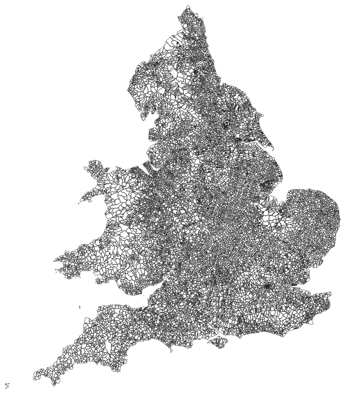

# historic-census-gb-geocoder

Geocode Historic Great British Census Data 1851-1911

## Installation

### Set up a conda environment

I recommend installation via Anaconda (refer to [Anaconda website and follow the instructions](https://docs.anaconda.com/anaconda/install/)).

* Create a new environment for `historic-census-gb-geocoder` called `geocoder_py38`:

```bash
conda create -n geocoder_py38 python=3.8
```

* Activate the environment:

```bash
conda activate geocoder_py38
```
### Method 1

***Not added to pypi yet - use method 2***
### Install `historic-census-gb-geocoder`:

 ```bash
pip install historic-census-gb-geocoder
```

### Method 2

* Clone `historic-census-gb-geocoder` source code:

```bash
git clone https://github.com/Living-with-machines/historic-census-gb-geocoder.git
```

* Install:

```bash
cd /path/to/historic-census-gb-geocoder
pip install -v -e .
```

Edit `/path/to/` as appropriate to the directory that you cloned `historic-census-gb-geocoder` into. E.g. `/Users/jrhodes/historic-census-gb-geocoder`

## Set parameters

The `historic-census-gb-geocoder-params.json` file allows you to adjust the following for each census year:

* "Type" - set to "full" to run on all data for that census year, set to "testing" to run on a sample of the data, or set to "no" to skip that year.
* "use_existing_files" - set to "yes" to re-use pre-processed geometry files and to proceed to string matching census records to street names. Set to "no" to create processed geometry files before conducting string matching. Setting to "yes" speeds the script up significantly because the creation of new street geometries using historic boundary data is computationally intensive.

```json
{"EW_1851":{"type":"full","use_existing_files":"yes"},
"EW_1861":{"type":"full","use_existing_files":"yes"},
"EW_1881":{"type":"full","use_existing_files":"yes"},
"EW_1891":{"type":"full","use_existing_files":"yes"},
"EW_1901":{"type":"full","use_existing_files":"yes"},
"EW_1911":{"type":"full","use_existing_files":"yes"},
"SCOT_1851":{"type":"full","use_existing_files":"yes"},
"SCOT_1861":{"type":"full","use_existing_files":"yes"},
"SCOT_1871":{"type":"full","use_existing_files":"yes"},
"SCOT_1881":{"type":"full","use_existing_files":"yes"},
"SCOT_1891":{"type":"full","use_existing_files":"yes"},
"SCOT_1901":{"type":"full","use_existing_files":"yes"}}

```
## Run `historic-census-gb-geocoder`

```bash
python3 historic_census_gb_geocoder.py
```

## Outputs


## Documentation

### Data Input
This is a list and discription of the datasets you need to download and store in `data/input` in order to run the scripts correctly.

#### 1. Integrated Census Microdata (I-CeM)

*Some information here is specific to LwM Project because of the need to ingress and egress between Tier 1 and Tier 3 DataSafeHaven. Readme and code will need editing to remove safehaven steps upon public release.*

`census_anonymisation_egress` contains igitised individual-level 19th and early 20th century census data for Great Britain, covering England and Wales 1851-1911 (except 1871), and Scotland 1851-1901.

 There are two versions of I-CeM with different access restrictions. You need both to perform geocoding on the full I-CeM dataset. There is an anonymised version ([SN 7481](https://beta.ukdataservice.ac.uk/datacatalogue/studies/study?id=7481)) and a 'Names and Addresses - Special Licence' version ([SN 7856](https://beta.ukdataservice.ac.uk/datacatalogue/studies/study?id=7856)). The anonymised version ([SN 7481](https://beta.ukdataservice.ac.uk/datacatalogue/studies/study?id=7481)) is downloadable via the UKDS after signing up to their standard end user licence. The anonymised version does not contain individuals' names and addresses but contains a unique id `RecID` for each person that links them to their name and address held in the 'Special Licence' version ([SN 7856](https://beta.ukdataservice.ac.uk/datacatalogue/studies/study?id=7856)). As its name suggests, access to the name and address data in I-CeM is by application for a special licence, which requires review by UKDS and the owners ([Findmypast](https://www.findmypast.co.uk)) of the transcriptions on which I-CeM is based.

Further documentation on I-CeM, including how it was created and the variables it contains can be found [here](https://www.essex.ac.uk/research-projects/integrated-census-microdata).


#### 2. 1851 Parish Boundary Data for England and Wales (ENGLAND AND WALES ONLY)
`data/input/1851EngWalesParishandPlace` contains a shapefile (`.shp`) and associated files of 1851 Parish Boundary data for England and Wales.


This boundary dataset can be linked to I-CeM using `UKDS_GIS_to_icem.xlsx` (see point 7 below) to create consistent parish geographies for England and Wales across the period 1851-1911.

The files and documentation explaining the creation of the boundaries and the fields in the dataset are available from the UKDS [here](https://reshare.ukdataservice.ac.uk/852816/). Access to the files requires registration with the UKDS. The Documentation is open access.

Citation:

>Satchell, A.E.M and Kitson, P.K and Newton, G.H and Shaw-Taylor, L. and Wrigley, E.A (2018). 1851 England and Wales census parishes, townships and places. [Data Collection]. Colchester, Essex: UK Data Archive. 10.5255/UKDA-SN-852232


#### 3. Ordnance Survey Open Roads
`data/input/oproad_essh_gb-2` contains shapefiles and documentation from the Ordnance Survey's Open access modern road vector data. Available here to download: https://www.ordnancesurvey.co.uk/business-government/products/open-map-roads.

`oproad_essh_gb-2` contains a `data` folder, which stores `RoadLink` and `RoadNode` files. historic-census-gb-geocoder only requires the `RoadLink` files.

#### 4. Registration Sub-District (RSD) Boundary Data (ENGLAND AND WALES ONLY)

*Supplied directly by Joe Day at Bristol and Alice Reid at Cambridge - supposedly in the process of being deposited with UKDS. Update this when link to UKDS ready.*

`data/input/rsd_boundary_data` contains a shapefile and associated files of boundary data for Registration Sub-Districts in England and Wales 1851-1911. The correct RSD boundaries for each year are created by 'dissolving' the geometries on the appropriate `CEN` field, e.g. `CEN_1851` to create 1851 boundaries or `CEN_1901` to create 1901 boundaries.

#### 5. Parish-Registration Sub-District (RSD) Dictionaries (ENGLAND AND WALES ONLY)

*Supplied directly by Joe Day at Bristol and Alice Reid at Cambridge - supposedly in the process of being deposited with UKDS. Update this when link to UKDS ready.*

*Folder contains the word 'encoding' because the original files given to us weren't reading correctly (no matter which encoding I specified) so I re-encoded them to 'utf-8' to get them to work. This could be tidied up in future.*

`parish_dicts_encoding` contains a series of data dictionaries for linking I-CeM to the RSD Boundary Data (point 4 above). Ignore `finalEWnondiss1851_1911.txt`, `PAR1851_RSD_MATCH.txt` and `1871_DICTIONARY_CODED.txt`.

The dictionaries link the `CEN` fields in the RSD Boundary Data, e.g. `CEN_1851` to unique parish identifier `ParID` in I-CeM. For example, the 1851 dictionary lists each `ParID` in the 1851 census file and the corresponding `CEN_1851`. This tells us which parish lies within which registration sub-district.

#### 6. GB1900 Gazetteer

`gb1900_gazetteer_complete_july_2018.csv` contains transcriptions of text labels from the Second Edition County Series six-inch-to-one-mile maps covering the whole of Great Britain, published by the Ordnance Survey between 1888 and 1914. As well as the labels, GB1900 Gazetteer contains the geographic coordinates of the labels (usually taken from the upper, left-hand corner of the label).

The version of the GB1900 Gazetteer used in this repo is the 'COMPLETE GB1900 GAZETTEER', which can be downloaded from [here](http://www.visionofbritain.org.uk/data/#tabgb1900). It is available on a CC-BY-SA licence.

#### 7. 1851EngWalesParishandPlace I-CeM Lookup Table (ENGLAND AND WALES ONLY)


#### 8. Street Standardisation

*The naming conventions need to be improved here - this file is for use with the GB1900 Gazetteer.*

*There is plenty of scope for expanding the range of regex patterns used to clean the address strings.*

`street_standardisation.json` - contains regex patterns to find and replacement words. Currently used to expand abbreviations in GB1900 Gazetteer, e.g. Rd to Road.

#### 9. I-CeM Street Standardisation

*There is plenty of scope for expanding the range of regex patterns used to clean the address strings.*

`icem_street_standardisation.json` - contains regex patterns to find and replacement words. Currently used to expand abbreviations in I-CeM, e.g. Rd to Road. Also removes extra letters left at the start of the address strings after removing digits (to comply with safehaven rules). E.g. '68A High Street' leaves 'A High Street', which is then cleaned to 'High Street'.

#### 10. Scotland Parish Boundary data (SCOTLAND ONLY)

`scot_parish_boundary/` - contains two Scottish parish boundary files and a lookup table that links the boundary files to I-CeM.

There are Scottish parish boundary datasets for pre- and post-1891 civil parishes. A detailed discussion of the dataset and changes to the boundaries of Scottish parishes, see [National Records of Scotland - Historic Civil Parishes pre-1891](https://www.nrscotland.gov.uk/statistics-and-data/geography/our-products/other-national-records-of-scotland-nrs-geographies-datasets/historic-civil-parishes-pre-1891) and [National Records of Scotland - Civil Parishes (post 1891)](https://www.nrscotland.gov.uk/statistics-and-data/geography/our-products/other-national-records-of-scotland-nrs-geographies-datasets/civil-parishes). For further information on the major boundary changes around 1891, see also [Genuki](https://www.genuki.org.uk/big/sct/shennan/boundaries).

`scot_parish_boundary/CivilParish_pre1891/` - contains the shapefile and associated files for pre-1891 Scottish parish boundaries.


`scot_parish_boundary/CivilParish1930` - contains the shapefile and associated files for post-1891 Scottish parish boundaries.


Unlike the parish boundary datasets for England and Wales, there was no openly available lookup table that directly linked parish boundary data to I-CeM. Without a similar lookup table for Scotland, we would not be able to perform geo-blocking strategies required in the geo-coding script (e.g. only trying to match streets from the same parish across OS Open Roads/GB1900 and I-CeM).

To link the Scottish parish boundary datasets to I-CeM, a lookup table has been created that associates each parish in the pre- and post-1891 boundary files with a corresponding parish in I-CeM. A separate lookup table for each census year has been produced - firstly, to use the most appropriate boundary dataset (pre or post 1891), and secondly, to link to parishes from each census year via the `ParID` variable (rather than rely on consistent parish geographies across census years - the `ConParID` variable).

The structure of the lookup table is as follows:

FIELD|VALUE
--|--
"name" / "JOIN_NAME_"|Parish name from boundary dataset; "name" for post-1891, "JOIN_NAME_" for pre-1891.
ParID_link|ParID of corresponding parish in I-CeM
Notes|Notes on how the link was made; "exact" = parish names matched exactly between the boundary dataset and I-CeM; see individual files for other match types.

Scotland, 1901 example:

name| ParID_link | notes
-- | -- | --
NEW CUMNOCK | 100595 | exact
OLD CUMNOCK | 100597 | exact
DAILLY | 100572 | exact
SMALL ISLES | 100119 | exact


### Data Output

*Needs adding 


